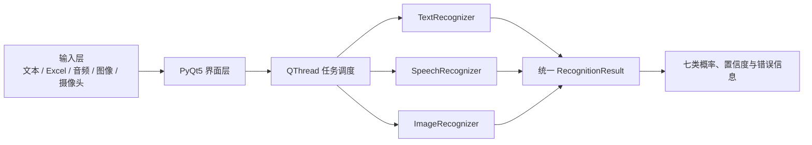

# 多模态情绪智能识别系统

> 基于 PyQt5 的本地多模态情绪识别研究原型，统一支持中文/英文文本、语音以及图像与摄像头输入，并将结果映射到七类情绪空间。

## 摘要

本项目面向多模态情感计算（Multimodal Affective Computing）场景，实现了一套可在 Windows 本地运行的桌面应用。系统采用统一的七分类标签集合，对文本、语音和面部图像分别执行模态内推理，并以一致的结果结构输出预测类别、置信度和完整类别概率。文本模块支持基于 mBERT 或 XLM-R 的中英双语微调；语音模块采用人工声学特征与 RBF-SVM；图像模块采用 YuNet 人脸检测和 Progressive Teacher / MobileFaceNet 表情分类模型。界面层通过 `QThread` 执行耗时任务，避免推理阻塞主线程。

本仓库强调可复现性与结果边界：不使用随机结果或关键词规则伪装模型输出；模型缺失、文件损坏或输入无效时返回明确错误。仓库不提交大体积模型权重、构建产物和 TESS 原始音频，使用者需按照本文说明配置或训练相应模型。

## 界面展示

以下截图由当前代码在本地配置模型的环境中生成，未包含用户输入或个人数据。

### 文本情绪识别


### 语音情绪识别


### 图像与摄像头情绪识别


## 研究任务定义

系统将各模态输入统一映射为七类离散情绪：

| 英文标签 | 中文标签 | 统一内部标识 |
| --- | --- | --- |
| Anger | 愤怒 | `anger` |
| Disgust | 厌恶 | `disgust` |
| Fear | 恐惧 | `fear` |
| Joy | 喜悦 | `joy` |
| Sadness | 悲伤 | `sadness` |
| Surprise | 惊讶 | `surprise` |
| Neutral | 中性 | `neutral` |

每次成功推理返回：预测情绪、最高类别概率、七类概率分布以及模型名称。概率主要用于界面展示和同一模型内部的相对置信度解释，不应直接视为经过校准的现实概率。

## 系统方法

| 模态 | 输入 | 方法 | 输出 |
| --- | --- | --- | --- |
| 文本 | 中文/英文单句、Excel 文本列 | Hugging Face Transformer；支持 mBERT、XLM-R 等七分类模型 | 类别、置信度、七类概率 |
| 语音 | WAV、MP3 | 16 kHz 单声道归一化；MFCC、Delta-MFCC、能量、过零率、频谱质心、滚降与时长统计；标准化 RBF-SVM | 类别、置信度、七类概率 |
| 图像 | PNG、JPG、BMP、WebP、摄像头帧 | OpenCV Zoo YuNet 人脸检测；五点对齐；Progressive Teacher / MobileFaceNet 表情分类 | 单人或多人面部区域及七类概率 |

### 文本模块

文本模型通过 `AutoTokenizer` 与 `AutoModelForSequenceClassification` 加载。训练脚本支持固定随机种子、验证集最优 Macro-F1 模型选择、总体与中英文分组评估、分类报告和混淆矩阵。GoEmotions 多标签样本不会被任意压缩为单标签，而是明确排除，从而降低标签语义污染。

### 语音模块

音频统一解码为 16 kHz 单声道。WAV 使用标准 RIFF 读取，MP3 通过 `miniaudio` 解码，无需外部 FFmpeg。每条音频提取固定长度统计特征，随后输入带 `StandardScaler` 的 RBF-SVM。TESS 数据划分按“说出的单词”分组为 70%/15%/15%，同一词项不会跨训练、验证和测试集合，以减少词汇泄漏。

### 图像模块

图像识别首先使用 YuNet 检测人脸及五点关键点，再对齐至 112×112 像素，最后由 MobileFaceNet 表情模型输出七分类分数。系统对大图缩放检测，并在未检测到人脸时尝试旋转方向；摄像头识别完全在本地进行。

## 软件架构



核心分层如下：

- `emotion_app/domain.py`：统一标签、别名归一化与结果数据结构。
- `emotion_app/recognizers/`：文本、语音与图像识别器及公共协议。
- `emotion_app/audio_features.py`：音频读取、重采样与声学特征提取。
- `emotion_app/ui/`：桌面界面、图像/摄像头标签页和结果可视化。
- `emotion_app/workers.py`：后台任务与 Qt 信号封装。
- `scripts/`：数据准备、文本训练、语音训练和命令行预测。
- `tests/`：领域模型、数据处理、识别器和界面行为测试。

## 数据集与预处理

### 文本数据

当前本地固定数据版本 `dataset_v1` 由 GoEmotions 的 Ekman 映射数据与 OCEMOTION 中文数据构成。处理后数据不提交到 Git，但 `manifest.json` 记录的统计如下：

| 项目 | 数量 |
| --- | ---: |
| 总样本 | 85,153 |
| 英文样本 | 49,469 |
| 中文样本 | 35,684 |
| 训练集 | 68,102 |
| 验证集 | 8,514 |
| 测试集 | 8,537 |

数据划分使用固定随机种子 `42`。类别分布不均衡，其中 `joy` 与 `neutral` 样本较多，`fear` 样本明显较少，因此模型比较应优先报告 Macro-F1，而不能只报告 Accuracy。

### 语音数据

语音实验采用 Toronto Emotional Speech Set（TESS）。本地清洗后共使用 2,798 条样本，包含 OAF、YAF 两位说话人和七类情绪。原始语音数据约 537 MB，未纳入仓库；请从合法来源获取，并遵守数据集许可与引用要求。

## 实验结果与解释

### 语音模型

| 评估设置 | Accuracy | Macro-F1 | 解释 |
| --- | ---: | ---: | --- |
| 按词项分组的本地测试集 | 100.00% | 100.00% | 训练与测试包含相同说话人，结果可能受说话人特征和受控录音条件影响 |
| 双向留一说话人平均 | 47.75% | 40.16% | 更能反映跨说话人泛化，说明模型尚不适合无约束真实场景 |

高同域分数不代表开放环境性能。TESS 录音条件受控且说话人数很少，模型可能学习到说话人、录音环境或语料风格。项目因此同时报告跨说话人结果，并将其作为主要泛化边界。

### 文本与图像模型

仓库没有提交最终文本模型的统一实验报告，也未在自建独立图像测试集上给出准确率。训练脚本会生成文本模型的 Accuracy、Macro-F1、分类报告和混淆矩阵；图像模块当前使用上游预训练模型。为保持学术严谨性，README 不声明未经独立复现实验验证的性能数字。

## 环境要求

- Windows 10/11 64 位
- Python 3.10 或 3.11
- 建议内存 16 GB；训练 Transformer 时建议使用 NVIDIA GPU
- 摄像头识别需要 Windows 相机权限

创建环境：

```powershell
python -m venv .venv
.venv\Scripts\python -m pip install --upgrade pip
.venv\Scripts\python -m pip install -r requirements.txt
```

训练和测试依赖：

```powershell
.venv\Scripts\python -m pip install -r requirements-dev.txt
```

## 模型配置

Git 默认忽略 `models/` 下的模型文件，只保留说明文档。

### 文本模型

将完整 Hugging Face 七分类模型放入 `models/text/`，至少包含：

- `config.json`
- `model.safetensors` 或 `pytorch_model.bin`
- tokenizer 配置与词表文件

也可设置环境变量：

```powershell
$env:EMOTION_TEXT_MODEL='D:\models\emotion-text'
```

### 语音模型

运行训练脚本后，将以下文件保留在 `models/speech/`：

- `speech_model.joblib`
- `metrics.json`
- `confusion_matrix.csv`

### 图像模型

从 [OpenCV Zoo](https://github.com/opencv/opencv_zoo) 获取模型，并放入 `models/image/`：

- `face_detection_yunet_2023mar.onnx`
- `facial_expression_recognition_mobilefacenet_2022july.onnx`

## 运行方法

启动桌面应用：

```powershell
.venv\Scripts\python app.py
```

命令行文本预测：

```powershell
.venv\Scripts\python scripts\predict_text.py "今天终于完成实验了，我非常开心" --model models\text
.venv\Scripts\python scripts\predict_text.py "I am very happy with this result" --model models\text
```

Excel 批量识别接受 `text`、`content`、`文本` 或 `内容` 列，并在输出中增加预测情绪、置信度和错误信息。

## 训练复现

### 准备文本数据

```powershell
.venv\Scripts\python scripts\prepare_dataset.py `
  --goemotions-dir vendor\goemotions-pytorch\data\ekman `
  --chinese-csv data\raw\chinese_emotions.csv `
  --output-dir data\processed\dataset_v1
```

### 训练 mBERT

```powershell
.venv\Scripts\python scripts\train_text_model.py `
  --data-dir data\processed\dataset_v1 `
  --model-name bert-base-multilingual-cased `
  --output-dir outputs\mbert `
  --epochs 4 --batch-size 8 --gradient-accumulation 2 `
  --learning-rate 2e-5 --max-length 128 --seed 42
```

### 训练 XLM-R

```powershell
.venv\Scripts\python scripts\train_text_model.py `
  --data-dir data\processed\dataset_v1 `
  --model-name xlm-roberta-base `
  --output-dir outputs\xlm-roberta `
  --epochs 4 --batch-size 4 --gradient-accumulation 4 `
  --learning-rate 2e-5 --max-length 128 --seed 42
```

### 训练语音模型

```powershell
.venv\Scripts\python scripts\train_speech_model.py `
  --data-dir archive_sound `
  --output-dir models\speech `
  --seed 42
```

详细的多人协作训练与交付步骤见 [TRAINING_GUIDE.md](TRAINING_GUIDE.md)。

## 测试与打包

运行测试：

```powershell
$env:QT_QPA_PLATFORM='offscreen'
.venv\Scripts\python -m pytest
```

生成 Windows EXE：

```powershell
.venv\Scripts\pyinstaller emotion_app.spec
```

当前 PyInstaller 配置嵌入语音与图像模型及其推理依赖，但不嵌入约 4.4 GB 的 Transformer 文本运行时。文本训练与源码推理仍可正常使用；若需完整离线 EXE，应单独设计模型下载或分发方案。

## 可复现性约定

- 固定数据划分与随机种子 `42`。
- 使用 `manifest.json` 和 SHA-256 校验数据版本。
- 记录训练命令、依赖版本、GPU 信息和模型指标。
- 文本评估同时报告总体、中文和英文指标。
- 语音评估同时报告同域划分与跨说话人结果。
- 禁止以关键词规则、随机概率或静默回退替代真实模型输出。

## 局限性、伦理与隐私

- 离散七分类不能覆盖真实情绪的连续性、混合性和语境依赖。
- 文本模型可能受到语言、领域、类别不均衡和标注规范差异影响。
- TESS 仅含两位说话人，年龄、口音和录音环境覆盖有限。
- 面部表情不等同于内在情绪；图像结果不应作为医疗、招聘、教育评判或执法依据。
- 系统默认本地推理，不主动上传文本、音频、图像或摄像头帧。
- 使用数据集、预训练模型及人物影像时，应遵守许可、知情同意和隐私要求。

## 项目结构

```text
.
├── app.py
├── emotion_app/
│   ├── recognizers/
│   ├── ui/
│   ├── audio_features.py
│   ├── domain.py
│   └── workers.py
├── scripts/
├── tests/
├── data/
├── models/
├── vendor/
├── docs/images/
├── emotion_app.spec
└── requirements*.txt
```

## 参考文献与上游项目

1. Demszky, D., et al. (2020). *GoEmotions: A Dataset of Fine-Grained Emotions*. Proceedings of ACL 2020. [论文](https://aclanthology.org/2020.acl-main.372/)
2. Li, M., Long, Y., Lu, Q., & Li, W. (2016). *Emotion Corpus Construction Based on Selection from Hashtags*. Proceedings of LREC 2016. [论文](https://aclanthology.org/L16-1291/)
3. Dupuis, K., & Pichora-Fuller, M. K. *Toronto Emotional Speech Set (TESS)*. Scholars Portal Dataverse. DOI: `10.5683/SP2/E8H2MF`.
4. OpenCV. *OpenCV Zoo: YuNet Face Detection and Facial Expression Recognition Models*. [项目仓库](https://github.com/opencv/opencv_zoo)
5. Monologg. *GoEmotions-pytorch*. [项目仓库](https://github.com/monologg/GoEmotions-pytorch)

完整第三方来源、许可和修改范围见 [THIRD_PARTY_NOTICES.md](THIRD_PARTY_NOTICES.md)。

## 许可证

项目自有代码采用 [MIT License](LICENSE)。第三方代码、数据和模型分别遵循其原始许可证；使用和再分发前请检查对应许可条款。