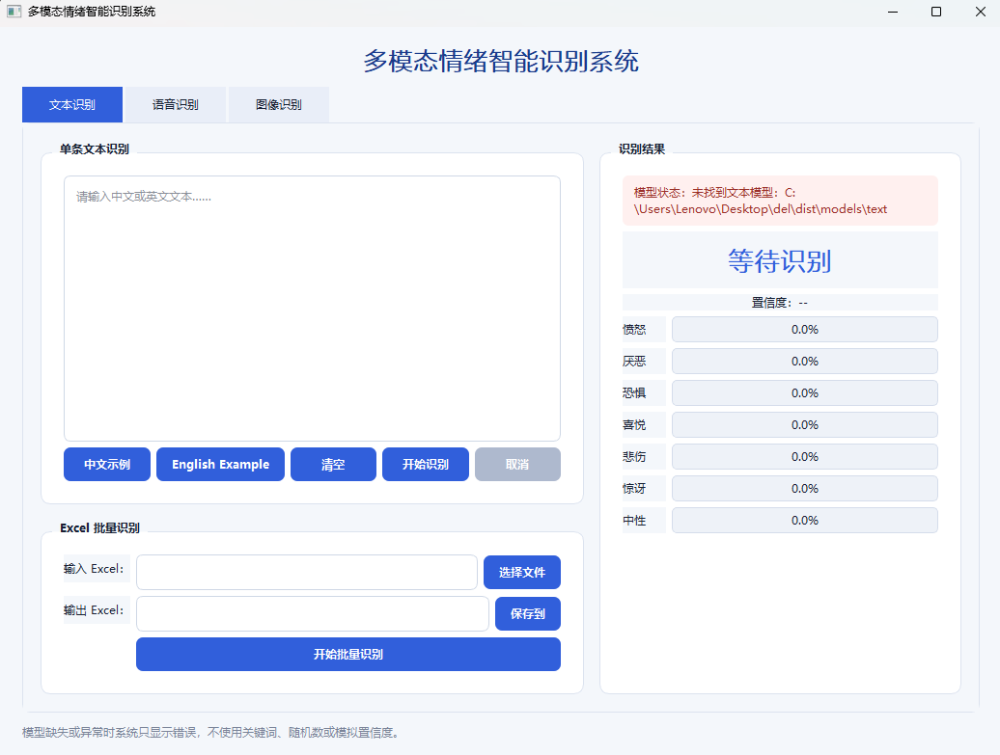
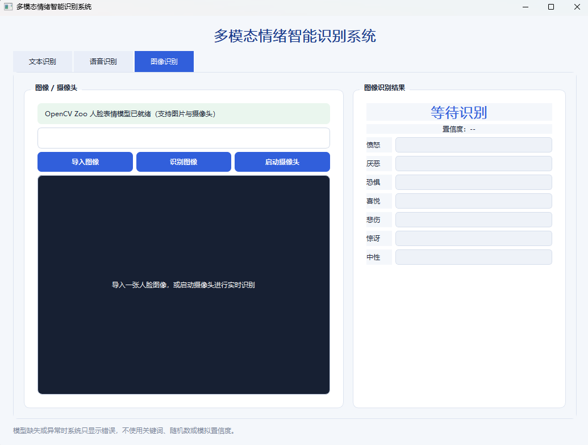
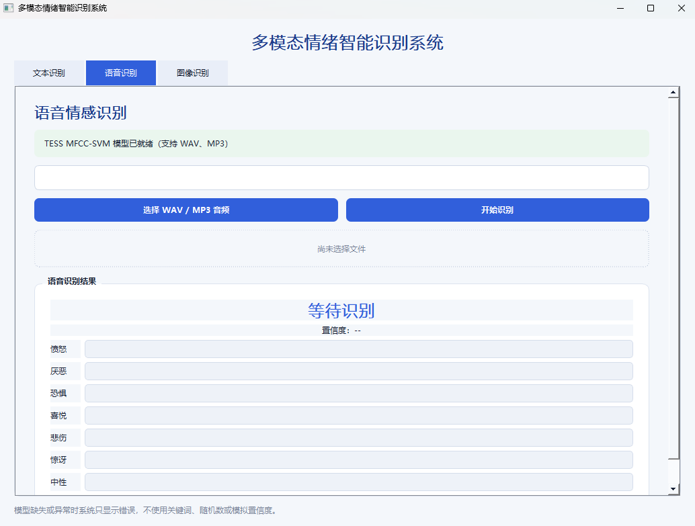
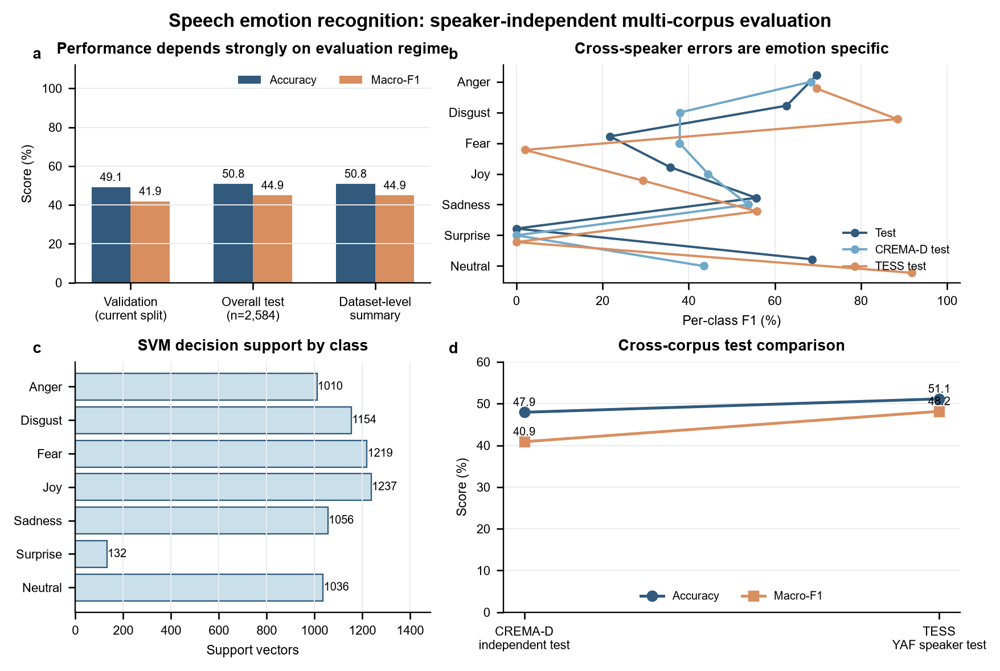
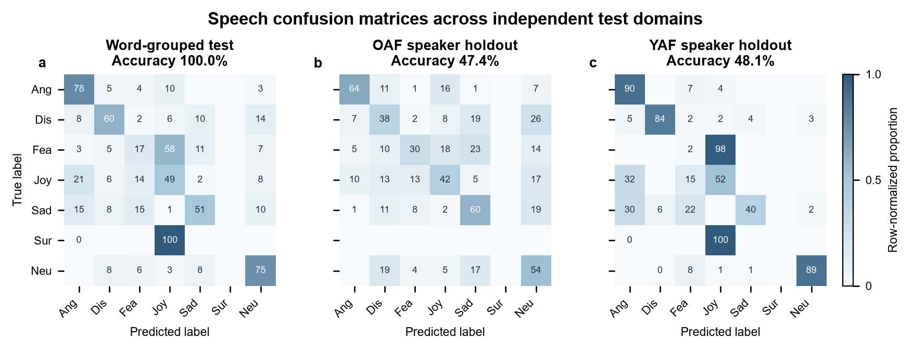
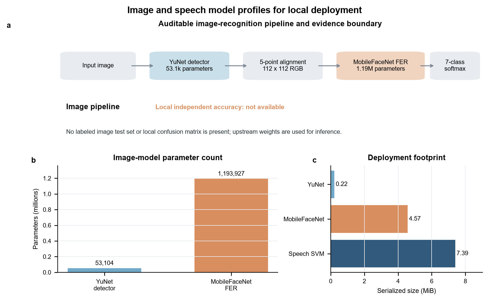

# Chat Emotion：多模态情感识别桌面系统

一个面向科研演示与课程实验的本地多模态情感识别系统。项目以统一的七类情感空间为核心，分别处理文本、面部图像和语音输入，并通过 PyQt5 提供可视化桌面界面。代码、实验报告、科研绘图和绘图源数据均可审计；大型模型、原始数据集、缓存和构建产物不纳入 Git 仓库。

> 七分类标签：`anger`、`disgust`、`fear`、`joy`、`sadness`、`surprise`、`neutral`。

## 项目特点

- **文本情感识别**：基于 XLM-R 的中英文七分类模型。
- **图像情感识别**：基于 RAF-DB 训练的 SE-ResNet18，使用 YuNet 人脸检测和 Flip TTA。
- **语音情感识别**：以 WavLM 表征和 SIMSAN 分类头为主，保留传统 MFCC/RBF-SVM 回退方案。
- **本地桌面界面**：推理在本机完成，支持文本输入、图片选择和音频选择。
- **实验可复现**：训练、评估、ONNX 导出、模型检查和科研绘图脚本均位于 `scripts/`。
- **工程边界清晰**：数据统一放在 `datasets/`，模型放在 `models/`，实验输出放在 `outputs/`。

## 系统界面

| 文本识别 | 图像识别 | 语音识别 |
| --- | --- | --- |
|  |  |  |

## 方法概述

| 模态 | 输入 | 核心方法 | 运行时模型 |
| --- | --- | --- | --- |
| 文本 | 中文或英文文本 | XLM-R 序列分类 | Hugging Face 模型目录 |
| 图像 | 单人脸图片 | YuNet + SE-ResNet18 + Flip TTA | ONNX |
| 语音 | WAV/MP3 等音频 | WavLM 表征 + SIMSAN 分类头 | ONNX + Joblib |

三个模块共享统一的领域对象和结果格式。耗时推理通过工作线程执行，避免阻塞 Qt 主界面；资源路径同时兼容源码运行和 PyInstaller 打包环境。

## 实验结果

下表给出项目最终报告中的主要结果。详细实验设置、数据划分和误差分析见 [实验报告](docs/实验报告.md)。

| 模态 / 模型 | 评估集 | Accuracy | Macro-F1 | 说明 |
| --- | --- | ---: | ---: | --- |
| 文本 XLM-R | 七分类测试集 | 67.08% | 60.65% | 中英文统一标签空间 |
| 图像 SE-ResNet18 | RAF-DB 官方测试集 | 77.71% | 69.22% | Flip TTA Accuracy 78.16% |
| 语音 MFCC + RBF-SVM | 跨说话人测试，2,584 条 | 50.81% | 44.88% | 传统基线 |
| 语音 SIMSAN | 锁定测试集，1,224 条 | 54.98% | 54.57% | 主要盲测结果 |
| 语音 WavLM + SIMSAN | 同一固定测试集，1,224 条 | 66.58% | 66.81% | 测试集此前已被使用，属于非盲复评 |

最后一行不能解释为全新的独立盲测结果。仓库保留这一说明，避免因重复查看测试集而高估泛化性能。

## 科研绘图与源数据

科研绘图的 PNG、PDF、SVG 和对应 CSV/JSON 已纳入 `docs/research-figures/`。本地 `outputs/image_speech_research_figures/` 中还保留投稿级 TIFF 原稿，但 TIFF 不提交到 Git，以控制仓库体积。







## 工程结构

```text
chat_emotion/
├── app.py                         # 应用入口
├── emotion_app/                   # 业务逻辑、识别器和界面
│   ├── recognizers/
│   └── ui/
├── scripts/                       # 数据准备、训练、评估、导出和绘图
├── tests/                         # 自动化测试
├── datasets/                      # 统一数据目录
│   ├── project-data/
│   ├── GoEmotions-pytorch/
│   ├── OCEMOTION/
│   ├── TESS/
│   ├── CREMA-D/
│   └── EmoDB/
├── models/                        # 本地模型权重（Git 忽略）
├── outputs/                       # 本地实验输出（Git 忽略）
├── docs/                          # 实验报告、界面截图和科研绘图
├── vendor/                        # 第三方许可与必要资源
├── emotion_app.spec               # PyInstaller 配置
└── requirements*.txt              # 运行、开发与训练依赖
```

数据集的放置方式和 Git 跟踪策略见 [datasets/README.md](datasets/README.md)，模型文件布局见 [models/README.md](models/README.md)。

## 环境安装

推荐 Windows 10/11、Python 3.10 或 3.11。项目本地已保留 `.venv`，清理工程不会删除该环境；克隆仓库的用户需要自行创建环境。

```powershell
git clone https://github.com/Dumbo05/chat_emotion.git
cd chat_emotion
python -m venv .venv
.\.venv\Scripts\Activate.ps1
python -m pip install --upgrade pip
pip install -r requirements.txt
```

开发和测试依赖：

```powershell
pip install -r requirements-dev.txt
pytest
```

训练相关依赖：

```powershell
pip install -r requirements-train.txt
```

## 模型准备与运行

Git 仓库不包含大型模型权重。请按 [模型目录说明](models/README.md) 放置文本、图像和语音模型，或运行相应训练脚本生成。

源码运行：

```powershell
.\.venv\Scripts\python.exe app.py
```

若已生成本地发行版，也可直接运行 `dist/EmotionRecognition.exe`。发行版、虚拟环境和模型均保留在本地，但不会上传到源码仓库。

## 数据准备与训练

所有训练数据统一位于 `datasets/`。常用命令如下。

文本数据准备与训练：

```powershell
.\.venv\Scripts\python.exe scripts\prepare_dataset.py
.\.venv\Scripts\python.exe scripts\train_text_model.py `
  --data-dir datasets\project-data\processed\text `
  --model-name xlm-roberta-base `
  --output-dir models\text
```

RAF-DB 图像模型训练：

```powershell
.\.venv\Scripts\python.exe scripts\train_rafdb_model.py `
  --data-root datasets\project-data\processed\raf-db-basic\aligned `
  --labels datasets\project-data\raw\raf-db-basic\extracted\EmoLabel\list_patition_label.txt `
  --output models\image\rafdb_se_resnet18 `
  --architecture se_resnet18
```

语音传统基线与 SIMSAN：

```powershell
.\.venv\Scripts\python.exe scripts\train_speech_model.py `
  --tess-dir datasets\TESS `
  --crema-dir datasets\CREMA-D `
  --emodb-dir datasets\EmoDB

.\.venv\Scripts\python.exe scripts\train_simsan.py `
  --tess-dir datasets\TESS `
  --crema-dir datasets\CREMA-D `
  --emodb-dir datasets\EmoDB
```

WavLM 特征提取、分类头训练、固定测试评估和 ONNX 导出分别由 `extract_wavlm_features.py`、`train_wavlm_simsan_head.py`、`evaluate_wavlm_simsan_fixed_test.py` 与 `export_wavlm_simsan_onnx.py` 完成。

## 打包

```powershell
pip install pyinstaller
pyinstaller --noconfirm emotion_app.spec
```

`emotion_app.spec` 是唯一保留的可移植打包配置。带绝对路径的临时 spec、历史构建目录和旧版可执行文件已从工程中清理。

## 测试与质量控制

```powershell
.\.venv\Scripts\python.exe -m pytest
```

建议在提交前同时执行：

```powershell
git diff --check
git status --short
```

## 数据、隐私与限制

- 图像和语音推理默认在本地执行，项目不会主动上传用户输入。
- 模型预测仅用于科研、教学和软件演示，不应作为医疗、心理诊断、招聘或执法依据。
- 表情、文本和语音中的情绪信号受文化、语言、场景、身份与采集设备影响。
- RAF-DB、TESS、CREMA-D、EmoDB、OCEMOTION、GoEmotions 以及预训练模型均受各自许可约束；本项目许可证不替代其原始条款。
- 开源仓库不分发第三方原始数据和大型权重，保证仓库精简，也避免越权再分发。

## 许可证与第三方组件

项目代码采用 [MIT License](LICENSE)。第三方依赖与许可信息见 [THIRD_PARTY_NOTICES.md](THIRD_PARTY_NOTICES.md) 及 `vendor/` 中保留的上游许可文件。

## 引用

若本项目用于课程报告或科研工作，请引用本仓库，并同时引用实际使用的数据集、预训练模型和方法论文。实验数字应连同数据划分与“盲测/非盲复评”状态一起报告。