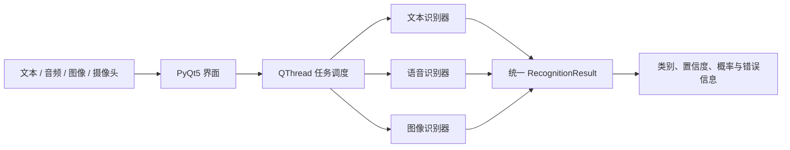

# 基于文本、语音与面部图像的本地多模态情绪识别系统实验报告

## 摘要

情绪识别系统常面临输入形式不统一、模型输出难以比较以及离线部署困难等问题。本项目设计并实现了一套面向 Windows 桌面的本地多模态情绪识别系统，在统一的七类情绪标签空间内分别处理中文/英文文本、语音和面部图像，并通过一致的结果协议输出预测类别、置信度与类别概率。文本模块比较了 mBERT 与 XLM-R 两种跨语言 Transformer；语音模块比较了手工声学特征与 RBF-SVM、SIMSAN 以及 WavLM 表征方案；图像模块采用 YuNet 完成人脸检测与对齐，并在 RAF-DB Basic 上从随机初始化训练 SE-ResNet18 表情分类器。实验表明，原始 XLM-R 在 8,537 条文本测试样本上取得 67.08% 准确率和 60.65% Macro-F1，整体优于原始 mBERT；后续 XLM-R 参数与 seed 对比实验进一步将最佳文本结果提高到 68.12% 准确率和 61.35% Macro-F1；2026 年 6 月 25 日在 RTX 3090 服务器上追加的 XLM-R large 微调实验最高达到 69.06% 准确率和 61.64% Macro-F1，但提升幅度有限，说明文本模块瓶颈主要来自中文分项和弱类别，而不只是模型规模。SE-ResNet18 在 RAF-DB 官方测试集上取得 77.71% 准确率和 69.22% Macro-F1，水平翻转测试时增强将准确率进一步提高到 78.16%；SIMSAN 双检查点集成在一次性锁定的跨说话人测试集上取得 54.98% 准确率和 54.57% Macro-F1。WavLM 方案在同一固定测试集上的复评结果达到 66.58% 准确率和 66.81% Macro-F1，但由于测试集此前已被打开，该结果不视为严格盲测。软件层面的 17 项自动化测试全部通过。结果说明，该系统已经形成可运行、可复现且能诚实暴露失效边界的三模态实验原型；但三种模态目前独立推理，尚未实现跨模态特征或决策融合，真实开放环境中的泛化能力仍需进一步验证。


2026 年 6 月 23 日补充的 image-v2 图像实验进一步在不改变自研 SE-ResNet18 主体、随机初始化和 RAF-DB Basic 数据来源的前提下，对图像模块进行了小型改进与部署回归。三组 image-v2 run 均通过日志完整性检查，其中 112×112 输入、Weighted Cross Entropy 与验证集 Macro-F1 选模的 B 组表现最好：Flip TTA 后官方测试 Accuracy 为 78.59%，Macro-F1 为 70.65%，fear F1 和 disgust F1 分别提高到 58.18% 和 47.73%。随后对该 ONNX 候选模型进行部署回归，确认输入形状、输出维度、label order、归一化和 logits 平均式 Flip TTA 均与训练配置一致；静态样例回归可以正常完成检测、对齐和分类，摄像头短测能够打开设备并读取 80 帧，但自动采集帧未检测到人脸，因此摄像头端分类延迟仍需用户在镜头前进一步确认。
2026 年 6 月 24 日补充的 image-v3 图像调优实验引入 FER2013 预训练再 RAF-DB 微调的方案，并继续使用 112×112 输入、Weighted Cross Entropy、验证集 Macro-F1 选模与 Flip TTA。三组 image-v3/FER 相关 run 均通过日志完整性检查，其中 `v3-fer20-raf90-ls005-lr0008-seed43` 表现最好：RAF-DB 官方测试 Accuracy + Flip TTA 为 81.71%，Macro-F1 + Flip TTA 为 73.80%，fear F1 和 disgust F1 分别达到 62.41% 和 51.53%。该结果明显高于 image-v2 B；最佳 run 已导出独立 ONNX 文件，但当前仍停留在训练评估阶段，尚未完成主程序部署回归或替换 `EmotionRecognition.exe`。
2026 年 6 月 26 日整理的 image-v4 强视觉模型实验进一步使用 `timm` 预训练视觉主干、FER2013 表情预训练、RAF-DB 微调与 soft-voting ensemble。按 validation Macro-F1 严格选型的 EfficientNetV2-M + ConvNeXt-Large + MaxViT-Base 三模型组合在 RAF-DB 官方测试集上取得 89.41% Accuracy 和 83.17% Macro-F1，fear/disgust F1 分别为 66.19% 和 71.21%；事后查看 test 指标的四模型组合可达到 89.60% Accuracy 和 84.23% Macro-F1，但不作为严格主结果。v4 已显著超过 SE-ResNet18 系列结果，但其依赖大规模预训练和多模型 ensemble，尚未完成本地应用部署回归。


2026 年 6 月 23 日进一步补充了 WavLM clean v4 与 clean v5 语音实验。与早期固定测试集复评不同，clean v4/v5 均重新建立说话人互斥的 train/validation/test 划分，并在 frozen plan 生成前保持测试集 sealed。clean v4 在 CREMA-D + EmoDB 的 17 位未见测试说话人、1,311 条测试样本上取得 79.02% Accuracy 和 79.08% Macro-F1，明显高于 clean v2/v3；clean v5 以提升 fear 和 sadness 为目标，但一次性测试结果降至 71.87% Accuracy 和 72.10% Macro-F1，fear F1 与 sadness F1 分别为 62.14% 和 61.47%。因此，本报告将 clean v4 作为当前语音模块的最佳研究模型与后续部署候选，同时保留 clean v5 作为“验证集改进未能迁移到新测试集”的负结果。
**关键词：** 情绪识别；多模态情感计算；跨语言文本分类；语音情感识别；面部表情识别；本地部署

## 1. 实验目的

本实验旨在构建一套可在 Windows 本地运行的情绪识别原型，并回答以下问题：

1. 能否用统一的七类情绪标签和结果结构接入文本、语音与图像三类输入；
2. 在固定数据划分下，不同文本基础模型的中英文情绪分类能力有何差异；
3. 语音模型在同域条件与跨说话人条件下的性能差距有多大；
4. 从随机初始化训练的轻量级面部表情模型能否在 RAF-DB 官方测试集上获得稳定表现；
5. 训练、推理、异常处理和桌面交互流程能否通过自动化测试与本地打包验证。

本项目所称“多模态”是指一个应用支持多种输入模态，并将结果映射至统一标签空间；当前版本不进行文本、语音和图像之间的联合建模或跨模态融合。

## 2. 系统总体设计

系统采用界面层、任务调度层、模态识别层和统一领域层四级结构。PyQt5 界面接收文本、Excel、音频、图片与摄像头帧；耗时推理由 `QThread`（Qt 提供的后台线程类）执行，以避免阻塞主线程；三个识别器分别完成模态内预测；最终由 `RecognitionResult` 统一封装七类概率、最高置信度、预测标签、模型名称与错误信息。系统默认在本地完成推理，不主动上传用户输入。

统一标签集合为愤怒（anger）、厌恶（disgust）、恐惧（fear）、喜悦（joy）、悲伤（sadness）、惊讶（surprise）和中性（neutral）。界面中的概率用于同一模型内部的相对置信度展示，不能直接解释为经过校准的现实概率。



## 3. 文本情绪识别模块

### 3.1 文本数据

文本数据由 GoEmotions 的 Ekman 映射版本与 OCEMOTION 中文语料构成。处理后的 `dataset_v1` 共包含 85,153 条单标签样本，其中英文 49,469 条、中文 35,684 条。训练集、验证集和测试集分别包含 68,102、8,514 和 8,537 条样本，随机种子固定为 42；三个数据文件均记录了 SHA-256 校验值。对于映射后仍含多个 Ekman 标签的 GoEmotions 样本，数据准备脚本选择排除而非强制压缩成单标签，以减少标签语义污染。

文本类别分布明显不均衡：喜悦样本为 32,079 条，恐惧仅为 1,287 条。因此，实验同时报告 Accuracy 与 Macro-F1，并以验证集 Macro-F1 选择最佳检查点。mBERT 与 XLM-R 均训练 4 个 epoch，最大序列长度为 128，学习率为 2×10⁻⁵，有效批量大小为 16。

### 3.2 模型算法、实现流程与参数调整

#### 3.2.1 mBERT 文本分类算法

mBERT 采用 `bert-base-multilingual-cased`（Google 发布的多语言 BERT 基础模型，保留英文大小写信息）。模型先使用 WordPiece（将生词拆成常见子词片段的分词算法）将中英文文本切分为子词，并加入 `[CLS]`、`[SEP]` 等特殊标记；每个 token 由词嵌入、位置嵌入和句段嵌入相加形成输入。12 层 Transformer 编码器利用多头自注意力计算句内任意 token 之间的相关性，每层包含 12 个注意力头、768 维隐藏状态和 3,072 维前馈网络。分类时取句级表示送入七分类线性层，得到 logits，再以 softmax 计算七类分数。

实现中使用 `AutoTokenizer`（Hugging Face 用于自动加载对应分词器的接口） 和 `AutoModelForSequenceClassification`（Hugging Face 用于自动加载文本分类模型的接口）加载预训练参数，将 `num_labels` 设为 7，并显式写入 `label2id/id2label`。输入最大长度由模型上限 512 调整为 128：情绪语料以短句为主，128 能覆盖绝大多数输入，同时显著降低注意力计算量和显存占用。batch 内不预先填充到固定长度，而由 tokenizer 动态 padding 到本批最长序列，进一步减少无效计算。

#### 3.2.2 XLM-R 文本分类算法

XLM-R 采用 `xlm-roberta-base`（Meta 发布的 XLM-R 基础模型，采用多语言 RoBERTa 预训练），主体同样是 12 层 Transformer、12 个注意力头和 768 维隐藏状态，但使用 250,002 规模的 SentencePiece（不依赖空格、直接从原始文本学习子词的分词方法）多语言词表，不依赖 BERT 的句段嵌入。更大的共享子词表能减少中文字符、英文词形及跨语言表达被切得过碎的情况。项目保持分类头、输入长度和评价方式与 mBERT 一致，使差异主要来自预训练模型及其分词体系。

#### 3.2.3 训练策略与参数调整

两个模型均采用交叉熵损失和 AdamW（将权重衰减与梯度更新解耦的 Adam 优化器）。初始学习率设为 2×10⁻⁵，属于预训练 Transformer 微调的保守量级，可避免较大学习率破坏已有语言表示；权重衰减设为 0.01。总更新步数前 10% 采用线性 warm-up（训练初期逐步升高学习率的预热策略），随后线性衰减。反向传播使用自动混合精度，并把梯度范数裁剪为 1.0，降低异常 batch 引起的梯度爆炸风险。

mBERT 的物理 batch 为 8、累积 2 次；XLM-R 参数文件更大，物理 batch 调为 4、累积 4 次，两者有效 batch 均为 16。这样既适配 8 GB 显存，也避免 batch 大小成为模型对照中的额外变量。训练轮数统一为 4，随机种子为 42；每轮在验证集计算 Accuracy 和 Macro-F1，按 Macro-F1 保存最佳模型，而不是按受多数类影响更大的 Accuracy 保存。

| 参数 | mBERT | XLM-R | 调整目的 |
| --- | ---: | ---: | --- |
| 编码层/注意力头/隐藏维度 | 12/12/768 | 12/12/768 | 保持基础规模可比 |
| 最大序列长度 | 128 | 128 | 适配短文本并降低显存 |
| epoch | 4 | 4 | 控制微调过拟合 |
| 学习率 | 2×10⁻⁵ | 2×10⁻⁵ | 保护预训练表示 |
| 物理 batch | 8 | 4 | 适配不同模型显存占用 |
| 梯度累积 | 2 | 4 | 统一有效 batch=16 |
| warm-up（训练初期逐步升高学习率的预热策略） | 10% | 10% | 稳定训练初期 |
| 梯度裁剪 | 1.0 | 1.0 | 抑制梯度异常 |
| 选模指标 | Macro-F1 | Macro-F1 | 适应类别不均衡 |

#### 3.2.4 相较基础实现的提升

项目没有修改 Transformer 的核心公式，提升主要来自训练和数据流程：将两个语料统一到同一七类空间；排除多标签歧义样本；固定数据划分、随机种子与 SHA-256；使用动态 padding、混合精度和梯度累积提高训练效率；按 Macro-F1 选模并分别报告中英文结果；加载阶段校验七类标签，模型异常时拒绝输出伪结果。对照中 XLM-R 的总体 Macro-F1 比 mBERT 高 1.05 个百分点，中文 Macro-F1 高 2.66 个百分点，但英文低 0.68 个百分点，因此提升应表述为“总体及中文子集改善”，而非全面领先。
#### 3.2.5 真实日志记录的训练演进

文本模型没有保存多组独立超参数试验。`member_b/train.log` 和 `A1/xlm-roberta/train.log` 均只记录了一次完整的四轮训练，训练备注还明确写明“是否修改参数：否”。因此，下表展示的是同一模型在固定参数下随 epoch 变化的真实训练过程，而不是事后虚构的调参消融。“初始版本”只能定义为第 1 个 epoch 的检查点；由于没有预训练模型直接进行七类分类的零样本评估日志，不能给出 epoch 0 的准确率。

**表 3-2　mBERT 单次训练的逐 epoch 记录。** 全程保持学习率 2×10⁻⁵、最大长度 128、物理 batch 8、梯度累积 2 次、有效 batch 16 和随机种子 42 不变。

| Epoch | 训练损失 | 验证损失 | 验证 Accuracy | 验证 Macro-F1 | 检查点判断 |
| ---: | ---: | ---: | ---: | ---: | --- |
| 1 | 1.1135 | 0.9199 | 66.38% | 57.30% | 首个可比较检查点 |
| 2 | 0.8589 | **0.8800** | **67.69%** | **60.24%** | Macro-F1 最高，保存为最终检查点 |
| 3 | 0.7071 | 0.9189 | 66.69% | 58.61% | 训练损失下降，但验证性能回落 |
| 4 | **0.5647** | 0.9857 | 67.10% | 58.90% | 继续训练未超过 epoch 2 |

mBERT 从 epoch 1 到 epoch 2 的验证 Macro-F1 提高了 2.94 个百分点，随后没有继续提高。最佳 epoch 2 检查点在 8,537 条测试样本上取得 66.79% Accuracy 和 59.60% Macro-F1。训练损失在 epoch 4 降至最低，但验证损失升至 0.9857，说明“训练更久”并没有带来更好的泛化；现有日志真正支持的有效决策是按验证 Macro-F1 选取 epoch 2，而不是某个未记录的参数调整。

**表 3-3　XLM-R 单次训练的逐 epoch 记录。** 全程保持学习率 2×10⁻⁵、最大长度 128、物理 batch 4、梯度累积 4 次、有效 batch 16 和随机种子 42 不变。

| Epoch | 训练损失 | 验证损失 | 验证 Accuracy | 验证 Macro-F1 | 检查点判断 |
| ---: | ---: | ---: | ---: | ---: | --- |
| 1 | 1.1042 | 0.9103 | 66.63% | 58.87% | 首个可比较检查点 |
| 2 | 0.8445 | **0.8698** | 68.57% | **61.35%** | Macro-F1 最高，保存为最终检查点 |
| 3 | 0.7325 | 0.8849 | **68.82%** | 60.62% | Accuracy 上升，但 Macro-F1 回落 |
| 4 | **0.6305** | 0.9161 | **68.82%** | 61.08% | 仍未超过 epoch 2 |

XLM-R 同样在 epoch 2 达到最高验证 Macro-F1。最佳检查点的测试 Accuracy 和 Macro-F1 分别为 67.08% 和 60.65%。这说明项目的模型选择目标确实影响了最终权重：若只按验证 Accuracy，会倾向选择 epoch 3 或 4；按预先确定的 Macro-F1 则选择 epoch 2。上述两份原始组员日志没有学习率、序列长度、类别权重或训练轮数的独立对照运行；后续补充实验另行保存于 `xlm-roberta-experiments` 和 `mbert_b`，用于估计 seed、学习率和最大长度对文本模块的影响。
### 3.3 对照实验结果

原始组员模型与后续参数搜索结果合并后，当前文本模块的主要结果如下。组员 A/B 的原始模型包含中英文分项指标；`mbert_b` 批量日志未保存中英文分项，因此只报告统一测试集结果。

| 模型或实验来源 | 具体配置 | 验证集最佳 Macro-F1 | 测试 Accuracy | 测试 Macro-F1 | 英文 Macro-F1 | 中文 Macro-F1 |
| --- | --- | ---: | ---: | ---: | ---: | ---: |
| XLM-R 参数搜索最佳项 | `lr=2e-5, max_length=128, seed=123` | 61.08% | **68.12%** | **61.35%** | **65.44%** | 50.73% |
| XLM-R 参数搜索次优项 | `lr=1e-5, max_length=128, seed=456` | 60.94% | 68.24% | 61.33% | 64.70% | 51.04% |
| 组员 A 原始 XLM-R | `xlm-roberta-base` | **61.35%** | 67.08% | 60.65% | 63.16% | **51.73%** |
| mBERT 批量实验最佳项 | `lr=1e-5, max_length=128, seed=43` | — | 66.94% | 60.19% | — | — |
| mBERT 批量实验次优项 | `lr=2e-5, max_length=96, seed=42` | — | 66.87% | 60.16% | — | — |
| 组员 B 原始 mBERT | `bert-base-multilingual-cased` | 60.24% | 66.79% | 59.60% | 63.84% | 49.07% |

按统一测试集 Macro-F1 排序，当前最佳总体文本模型是 `XLM-R + lr=2e-5 + max_length=128 + seed=123`，测试 Macro-F1 为 61.35%，比组员 B 原始 mBERT 高 1.75 个百分点，也比组员 A 原始 XLM-R 高 0.70 个百分点。若单独关注中文子集，组员 A 原始 XLM-R 的中文 Macro-F1 为 51.73%，高于参数搜索最佳 XLM-R 的 50.73%，说明中文分项仍存在 seed 或训练过程波动，不能只凭总体指标认定某个配置在中文上绝对最优。

XLM-R 的总体上限高于 mBERT。即使把 mBERT 批量实验中的最佳项纳入比较，mBERT 最高 Test Macro-F1 为 60.19%，仍低于 XLM-R 参数搜索最佳项的 61.35%。不过 mBERT 批量实验也修正了早期“没有调参对照”的不足：在 `mbert_b` 的 17 组日志中，`lr=1e-5, max_length=128, seed=43` 表现最好；`max_length=96` 的最佳结果非常接近，`max_length=64` 整体偏低；`5e-5` 学习率组不够稳定。

XLM-R 参数搜索共包含 `5e-6`、`1e-5`、`2e-5` 三个学习率和 42、123、456 三个 seed 的组合。最高 Test Macro-F1 出现在 `2e-5, seed=123`，但 `1e-5, seed=456` 的 Test Accuracy 更高，为 68.24%，且 Macro-F1 只低 0.02 个百分点。这说明 XLM-R 在当前搜索范围内对学习率和 seed 的差异较敏感，最终选型应以 Macro-F1、分语言指标和稳定性共同判断。

两种模型的中文表现均明显低于英文表现，说明统一标签并未消除语料来源、语言表达习惯和类别分布差异。由于中文数据规模较小且恐惧类样本稀缺，后续工作应优先检查分语言、分类别混淆矩阵，而不是仅追求整体准确率。


### 3.3.1 2026 年 6 月 25 日服务器 XLM-R large 补充实验

为检验“扩大预训练模型规模”是否能显著提升文本模块，本项目在一台 RTX 3090 24GB 服务器上追加了 `xlm-roberta-large` 微调实验。服务器环境为 Ubuntu 22.04、NVIDIA Driver 570.195.03、CUDA 12.8、PyTorch CUDA 版和 Transformers 4.46.3；训练数据仍使用同一份 `dataset_v1`，不重建数据集，也不改变 train/validation/test 划分。模型权重提前下载到 `/root/emotion-text/pretrained/xlm-roberta-large`，避免训练时受外网下载波动影响。所有实验仍训练 4 个 epoch，并按验证集 Macro-F1 选择最佳检查点。

本轮原计划继续排队运行 mDeBERTa 与更多 XLM-R large seed，但服务器在 2026 年 6 月 25 日 07:30 按预设脚本停止全部训练并打包结果，因此最终完整完成并进入本地归档的是前三个 XLM-R large 实验。结果包保存于 `server-results/text_final_0730_light`，其中 `outputs/text/summary.md` 和各 run 的 `metrics.json`、`confusion_matrix.csv`、`train.log` 可回查。

| 实验 | 学习率 | 最大长度 | seed | 验证 Macro-F1 | 测试 Accuracy | 测试 Macro-F1 | 英文 Accuracy | 英文 Macro-F1 | 中文 Accuracy | 中文 Macro-F1 |
| --- | ---: | ---: | ---: | ---: | ---: | ---: | ---: | ---: | ---: | ---: |
| `xlmr_large_local_lr2e-5_len128_seed42` | 2e-5 | 128 | 42 | **62.05%** | **69.06%** | 61.64% | 71.44% | 64.52% | **65.76%** | **51.77%** |
| `xlmr_large_local_lr1e-5_len128_seed42` | 1e-5 | 128 | 42 | 61.66% | 68.83% | 61.17% | **71.56%** | 65.22% | 65.03% | 43.94% |
| `xlmr_large_local_lr1e-5_len192_seed42` | 1e-5 | 192 | 42 | 61.36% | 68.71% | **61.73%** | 71.28% | **65.72%** | 65.14% | 51.08% |

按验证集 Macro-F1 和测试 Accuracy 综合判断，`xlmr_large_local_lr2e-5_len128_seed42` 是本轮服务器实验的最佳单模型。相较此前 XLM-R base 参数搜索最佳项（68.12% Accuracy、61.35% Macro-F1），XLM-R large 最佳项将 Accuracy 提高约 0.94 个百分点，将 Macro-F1 提高约 0.29 个百分点。该提升是真实存在的，但远小于从 base 到 large 所增加的计算成本，也远未接近 75% 或 80% 的预期目标。因此，单纯扩大模型规模不是当前文本模块的主要突破口。

最佳 XLM-R large 模型的测试集分类别 F1 如下：

| 类别 | Precision | Recall | F1 | 测试样本数 |
| --- | ---: | ---: | ---: | ---: |
| anger | 59.47% | 41.16% | 48.65% | 984 |
| disgust | 59.49% | 35.78% | 44.69% | 517 |
| fear | 68.29% | 60.43% | 64.12% | 139 |
| joy | 79.23% | 83.53% | 81.32% | 3,169 |
| sadness | 61.83% | 75.13% | 67.84% | 1,544 |
| surprise | 54.90% | 61.07% | 57.82% | 578 |
| neutral | 67.99% | 66.13% | 67.05% | 1,606 |

混淆矩阵显示，`anger` 和 `disgust` 的召回率偏低，是 Macro-F1 的主要拖累项；`joy`、`sadness`、`neutral` 相对稳定。分语言结果也说明中文仍是主要瓶颈：最佳 XLM-R large 的英文 Macro-F1 为 64.52%，中文 Macro-F1 为 51.77%。这与此前 XLM-R base 结果一致，说明跨语言分布差异、中文标签质量和弱类样本不足，比模型参数规模更关键。

训练日志进一步显示，三组 XLM-R large 均完整训练 4 个 epoch。最佳项 `lr=2e-5, max_length=128` 在第 3 个 epoch 达到最高验证 Macro-F1（62.05%），第 4 个 epoch 的训练损失继续下降，但验证损失上升，表现出轻微过拟合。因此，后续如果继续微调，应优先考虑早停、类别重加权、focal loss 或数据层面的弱类增强，而不是简单增加 epoch。

本轮服务器实验带来的结论是：

1. XLM-R large 可以小幅提高总体 Accuracy，但并不能把文本模块推到 75% 以上。
2. `lr=2e-5, max_length=128` 在本轮 large 实验中最稳，后续可作为 large 路线基准。
3. 继续堆 XLM-R large seed 的边际收益可能有限，除非用于集成；若目标是显著提升，应优先尝试 mDeBERTa、class weight/focal loss、中文样本审计和弱类增强。
4. 文本模块冲击 80% Accuracy 的核心风险已经从“模型不够大”转为“数据和类别边界是否足够清晰”。

### 3.4 为什么这样设计、失败在哪里及如何解读

**为什么采用 mBERT 和 XLM-R。** 项目需要一个模型同时处理中文和英文。如果分别训练单语模型，不仅要维护两套权重，还要先进行语言识别，并且难以统一比较。mBERT 的优势是结构成熟、模型规模相对可控；XLM-R 使用更大的多语言语料和共享子词词表，理论上更有利于跨语言迁移。因此两者构成“较轻的成熟基线”和“更强的多语言预训练模型”的合理对照。

**mBERT 和 XLM-R 失败在哪里。** 失败主要集中在中文愤怒、厌恶和惊讶。XLM-R 在中文测试集上的 F1 分别为 40.5%、45.3% 和 26.6%，明显低于中文喜悦 75.8% 和悲伤 67.8%。尤其是中文惊讶只有 90 条测试样本，召回率为 18.9%，多数惊讶文本没有被模型识别出来。一个直接可验证的数据问题是：中文测试子集中没有中性样本，但程序仍按统一七类计算 Macro-F1，中性类 F1 因支持数为 0 被记为 0。这会机械性拉低中文 Macro-F1。若只对中文实际存在的六类取平均，数值会高于报告中的七类 Macro-F1。因此，中文 51.73% 与英文 63.16% 的差距不能全部解释为模型中文理解能力不足。

除标签覆盖差异外，中文语料和英文 GoEmotions 来自不同来源，文本风格、标注规范和类别先验并不一致；惊讶、愤怒与厌恶也常依赖语境、反讽或隐含评价。上述因素与结果一致，但项目没有进行控制变量实验，因此只能作为可能原因，不能写成已经证明的机制。

**哪些改动真的有效。** 在原始组员对照中，XLM-R 相比 mBERT 将总体 Macro-F1 提高 1.05 个百分点，将中文 Macro-F1 提高 2.66 个百分点，这是直接由同一轮对照实验支持的改进。纳入后续搜索后，最佳 XLM-R 相比组员 B 原始 mBERT 的总体 Macro-F1 提高 1.75 个百分点；最佳 mBERT 批量实验相比组员 B 原始 mBERT 提高 0.59 个百分点。固定划分和哈希校验提高的是可复现性；动态 padding、混合精度和梯度累积提高的是训练可执行性。由于项目没有分别关闭这些工程措施进行消融，不能声称它们各自提高了准确率。

**不能过度解读的结果。** 第一，不能仅凭 XLM-R 总体领先就说它全面优于 mBERT，因为 mBERT 的英文 Macro-F1 反而高 0.68 个百分点。第二，不能把 softmax 分数当成真实情绪概率，项目未做温度缩放或可靠性校准。第三，测试数据来自既定语料，结果不能直接外推到聊天口语、网络反讽、长文档或中英混写。第四，中英文子集的标签覆盖不同，不能把两个 Macro-F1 当作完全同条件的语言能力比赛。

**建议展示的失败案例。** 从中文测试集中分别选取 2–3 条“惊讶→喜悦/愤怒”“愤怒→悲伤”“厌恶→愤怒”的误分类文本，展示真实标签、预测标签和七类分数；若文本涉及隐私，应使用公开语料编号或脱敏内容。

综合模型对照结果与跨语言部署需求，文本模块因此选用了 **XLM-R** 集成到 PyQt5 桌面界面，用于统一完成中文和英文文本的七类情绪预测。若后续替换权重，优先候选是 `XLM-R + lr=2e-5 + max_length=128 + seed=123`；若强调中文分项，则应同时保留组员 A 原始 XLM-R 作为对照。该选择主要依据 XLM-R 的总体 Macro-F1 上限高于 mBERT，而不意味着它在所有语言子集上都占优。

## 4. 语音情绪识别模块

### 4.1 数据集与基线

语音实验使用 TESS、CREMA-D 与 EmoDB。所有音频统一解码为 16 kHz 单声道。传统基线提取 MFCC（梅尔频率倒谱系数，用于描述语音频谱包络）、Delta-MFCC（MFCC 随时间变化的一阶动态特征）、能量、过零率、频谱质心、频谱滚降及持续时间等固定长度统计特征，并输入带 `StandardScaler`（按特征执行零均值、单位方差标准化）的 RBF-SVM。

为降低模型记忆说话人和录音环境的风险，后续实验使用按说话人划分的锁定协议。SIMSAN 的最终测试集在开发阶段保持封存，仅在配置冻结后评估一次，共 1,224 条样本、16 位未见说话人，覆盖愤怒、厌恶、恐惧、喜悦、悲伤和中性六类。由于现有数据中没有可作为未见说话人的惊讶样本，该类未进入最终盲测，但保留在验证阶段。

### 4.2 模型算法、实现流程与参数调整

#### 4.2.1 MFCC-RBF-SVM 基线

基线首先把音频重采样为 16 kHz 单声道，再提取 MFCC、Delta-MFCC、能量、过零率、频谱质心、频谱滚降和时长等统计量。每个变长音频被转换为固定 177 维向量，经 `StandardScaler` 做零均值、单位方差标准化，再输入 RBF 核 SVM（采用径向基函数核的支持向量机）。RBF 核通过样本间的非线性距离形成决策边界，适合小规模数据，且最终模型仅含 1,109 个支持向量、约 1.61 MiB。缺点是时间顺序被压缩成统计量，且说话人音色仍可能混入情绪特征。

#### 4.2.2 SIMSAN 网络

SIMSAN 将每条音频统一为 4 s：短音频循环补齐，长音频截取中心片段。随后以 512 点 FFT、400 sample 帧长、160 sample 帧移和 64 个 Mel 滤波器生成 Log-Mel 频谱。模型先生成两个输入视图：全局均值方差归一化保留整体频谱形状；逐频带归一化削弱稳定音色和通道响应。两个视图堆叠后，同时进入 3×3、5×3、7×3 卷积分支，分别感受窄、中、宽频率邻域，输出拼接为 48 通道。

频谱编码器由 64、96、128、160 通道的深度可分离残差块组成，并加入 Squeeze-and-Excitation（SE，利用全局信息为不同通道分配权重的注意力机制）通道门控。频率维聚合后，四个膨胀率为 1、2、4、8 的一维残差块建模短期到长期节奏。注意力统计池化对时间帧学习权重，同时计算加权均值和标准差，得到 320 维句级统计量；经全连接、BatchNorm、SiLU 和 Dropout 映射为 192 维嵌入，最后由情绪头输出七类 logits。

为降低说话人泄漏，192 维嵌入还连接说话人分类头。梯度反转层在前向时保持特征不变，在反向时把说话人梯度乘以负系数，使编码器不能依赖容易识别说话人的特征。总损失为 `L=L_emotion+0.15×L_speaker`，梯度反转强度从 0 平滑增加至 0.20。情绪损失使用 0.05 标签平滑；训练集采用类别频次倒数的 `WeightedRandomSampler`；频谱增强包含时间遮挡、频率遮挡、频移、时间伸缩和高斯噪声。

SIMSAN 默认最大 35 epoch、batch 48、AdamW 学习率 3×10⁻⁴、权重衰减 1×10⁻⁴，余弦退火最低至 2×10⁻⁶，梯度裁剪为 5.0，验证 Macro-F1 连续 8 轮不提升则停止。最终两个检查点按 0.76∶0.24 加权集成，这一权重在验证阶段冻结后才执行一次最终测试。

#### 4.2.3 WavLM-SIMSAN

WavLM 路线使用冻结的 `microsoft/wavlm-base-plus`（Microsoft 发布的 WavLM Base Plus 自监督语音预训练模型）编码器。波形最长保留 64,000 sample，并使用 attention mask 排除 padding。对输入层及各 Transformer 隐藏层分别计算掩码均值和标准差，将一条音频压缩为“层数×2×隐藏维度”的候选表示。项目先对每层训练 `LinearSVC(C=0.01)`（线性支持向量分类器，C 为正则化强度参数），按验证 Macro-F1 选前四层；再对这些层搜索 RBF-SVM 的 C∈{0.3,1,3,10}。最终选择第 10 层、C=3、`gamma=scale`、`class_weight=balanced` 的组合。

部署时把 WavLM 编码器导出为 ONNX，输入波形先去均值并除以标准差，ONNX Runtime 输出统计特征，joblib 分类头再给出概率。该实现把特征提取和分类头解耦，既可复用冻结特征，也避免桌面程序加载完整训练框架。

| 参数 | MFCC-SVM | SIMSAN | WavLM-SIMSAN |
| --- | --- | --- | --- |
| 输入表示 | 177 维统计特征 | 64 维 Log-Mel、4 s | WavLM 第 10 层均值+标准差 |
| 分类器 | RBF-SVM | 多尺度 CNN+时序残差+注意力头 | 标准化 RBF-SVM |
| 类别均衡 | SVM 配置 | 加权采样+标签平滑 | `class_weight=balanced` |
| 学习率/优化器 | 不适用 | 3×10⁻⁴/AdamW | SVM 搜索 C=0.3–10 |
| 关键正则化 | 特征筛选 | Dropout 0.25、GRL≤0.20 | 冻结编码器 |
| 选模指标 | Macro-F1 | 验证 Macro-F1 | 验证 Macro-F1 |

#### 4.2.4 提升及其边界

相较 MFCC-SVM，SIMSAN 增加了时频结构建模、类别均衡和说话人对抗学习；相较 SIMSAN，WavLM-SIMSAN 利用自监督预训练表示并通过逐层搜索选取最有效层。同一锁定验证集上，Macro-F1 从 SIMSAN 的 68.49% 提升至 80.47%，增加 11.98 个百分点。固定测试集复评从 54.57% 提升到 66.81%，但该测试集此前已经打开，因此不能把 12.24 个百分点写成严格盲测增益。
#### 4.2.5 真实日志记录的训练演进

`models/speech/simsan_metrics.json` 保存了 SIMSAN 每个 epoch 的训练损失、验证 Accuracy、验证 Macro-F1 和梯度反转强度。为避免把没有形成新最佳检查点的轮次伪装成“有效改进”，表 4-2 只列出验证 Macro-F1 刷新历史最优值的 epoch；其余轮次仍保留在原始 JSON 中。

**表 4-2　SIMSAN 完整运行中新最佳检查点的形成过程。** 模型结构和数据划分不变，梯度反转强度按训练进度逐步增大。

| Epoch | 训练损失 | 验证 Accuracy | 验证 Macro-F1 | 梯度反转强度 | 相对前一最佳值 |
| ---: | ---: | ---: | ---: | ---: | ---: |
| 1 | 2.1545 | 41.70% | 37.84% | 0.0000 | 初始记录 |
| 2 | 1.7477 | 49.06% | 44.37% | 0.0292 | +6.53 个百分点 |
| 4 | 1.5357 | 58.07% | 55.23% | 0.0829 | +10.86 个百分点 |
| 5 | 1.4773 | 57.96% | 56.80% | 0.1057 | +1.57 个百分点 |
| 7 | 1.4375 | 64.33% | 64.07% | 0.1415 | +7.27 个百分点 |
| 8 | 1.4121 | 65.78% | 66.58% | 0.1547 | +2.51 个百分点 |
| 10 | 1.3968 | **67.66%** | **68.49%** | 0.1735 | +1.91 个百分点，保存为最佳检查点 |

同一目录还保留了 `simsan_mild_metrics.json`，可与完整运行在相同验证集上比较。两个文件均标注 `SIMSAN-v1` 和同一锁定说话人划分，但没有保存完整训练命令，因此只能陈述日志中直接存在的差异，不能把结果差异归因给某一个未完整记录的参数。

| 日志文件 | 最佳 epoch | 最佳 epoch 的梯度反转强度 | 验证 Accuracy | 验证 Macro-F1 | 可支持的结论 |
| --- | ---: | ---: | ---: | ---: | --- |
| `simsan_mild_metrics.json` | 8 | 0.0774 | 54.09% | 47.18% | 一次较弱设置的已记录运行 |
| `simsan_metrics.json` | 10 | 0.1735 | **67.66%** | **68.49%** | 完整运行高 21.32 个 Macro-F1 百分点 |

MFCC-SVM 的结果文件只保存了最终 `best_C=3`，没有保存其他 C 候选的验证分数；WavLM-SIMSAN 只保存了最终第 10 层、C=3 的验证和固定测试结果，没有保存逐层、逐 C 的运行输出。因此，本报告不制作这两种模型的“逐步调参表”，也不把训练脚本中写出的搜索范围当作已经执行并取得某些分数的证据。
### 4.3 对照实验结果

| 模型与协议 | 测试样本数 | Accuracy | Macro-F1 | 证据等级 |
| --- | ---: | ---: | ---: | --- |
| 手工特征 + RBF-SVM，跨说话人测试 | 2,584 | 50.81% | 44.88% | 独立跨说话人测试 |
| SIMSAN 双检查点集成，锁定最终测试 | 1,224 | 54.98% | 54.57% | 一次性盲测，主要结论 |
| WavLM + SIMSAN，固定测试集复评 | 1,224 | **66.58%** | **66.81%** | 测试集已被先前模型打开，非严格盲测 |

在锁定的说话人独立测试中，SIMSAN 集成取得 54.98% Accuracy 和 54.57% Macro-F1。分类别 F1 中，愤怒最高（63.00%），喜悦最低（45.05%）；中性召回率达到 84.44%，但精确率仅为 41.64%，说明模型容易把其他情绪误判为中性。

WavLM 表征方案在同一固定测试集上达到 66.58% Accuracy 和 66.81% Macro-F1，相比 SIMSAN 数值分别提高 11.60 和 12.24 个百分点。然而，该测试集已被早期模型评估过，因此这一差异只能作为后续模型改进的复评证据，不能替代新建说话人盲测。传统 RBF-SVM 的测试样本数和具体划分与 SIMSAN 不完全相同，表中结果用于呈现工程演进，不作严格配对统计比较。


<!-- WavLM clean v4-v5 update -->
### 4.4 WavLM clean v2–v5 的干净评估、逐轮改动与结果

早期 WavLM-SIMSAN 的 66.81% Macro-F1 来自一个已经被前序模型打开过的固定测试集，因此只能说明 WavLM 表征在工程复评中优于 SIMSAN，不能作为严格盲测证据。为提高证据等级，后续重新建立了 WavLM clean v2、v3、v4 和 v5 协议：均使用 CREMA-D 与 EmoDB，排除只有两位说话人的 TESS；每一版都要求 train、validation 和 test 说话人完全互斥；所有超参数、层选择、PCA、类别权重和 bias 只能在 validation 上确定；frozen plan 生成后，test set 只允许评估一次。由此，“已完成新的干净评估，当前模型与测试说话人完全隔离”成为语音模块后续实验的基本约束。

#### 4.4.1 clean v4 与 clean v5 的数据划分

clean v4 和 clean v5 都重新进行了 speaker-independent 划分。二者的训练、验证和测试说话人互不重叠；测试集在 frozen plan 生成前保持 sealed，在一次性测试后才标记为 evaluated-once。v4 与 v5 的样本数接近，但说话人组合不同，因此 v5 不能被看作在 v4 test 上继续调参，而是一个新的 clean 协议。

| 协议 | 数据集 | Train speakers / samples | Validation speakers / samples | Test speakers / samples | Test status | 说明 |
| --- | --- | ---: | ---: | ---: | --- | --- |
| clean v4 | CREMA-D + EmoDB | 67 / 5,287 | 17 / 1,298 | 17 / 1,311 | evaluated-once | v4 frozen plan 后只评估一次，用于判断是否替换 v2/v3 |
| clean v5 | CREMA-D + EmoDB | 67 / 5,256 | 17 / 1,321 | 17 / 1,319 | evaluated-once | 新建协议，目标是改善 v4 中 fear 与 sadness 弱类 |

| 协议与 split | anger | disgust | fear | joy | sadness | neutral | 合计 |
| --- | ---: | ---: | ---: | ---: | ---: | ---: | ---: |
| v4 train | 931 | 886 | 896 | 900 | 895 | 779 | 5,287 |
| v4 validation | 235 | 212 | 219 | 218 | 220 | 194 | 1,298 |
| v4 test | 232 | 219 | 225 | 224 | 218 | 193 | 1,311 |
| v5 train | 929 | 890 | 893 | 891 | 887 | 766 | 5,256 |
| v5 validation | 235 | 213 | 224 | 225 | 224 | 200 | 1,321 |
| v5 test | 234 | 214 | 223 | 226 | 222 | 200 | 1,319 |

#### 4.4.2 从 v2 到 v5：每次协议改变与最终结果

下表按时间顺序记录了每一轮 clean WavLM 实验“改变了什么”和“得到什么结果”。其中 validation 指标只用于选模，test 指标只在 frozen plan 后评估一次；如果某轮测试集已经 evaluated-once，则不能再用于后续调参。

| 轮次 | 相对上一轮改变 | 主要验证/选择依据 | 冻结配置摘要 | 一次性测试结果 | 结论 |
| --- | --- | --- | --- | --- | --- |
| WavLM 固定测试集复评 | 在 SIMSAN 已打开的固定测试集上复评 WavLM 表征 | 逐层 WavLM 统计特征 + RBF-SVM 搜索；证据等级较低 | 第 10 层 mean+std + RBF-SVM，`C=3`，`gamma=scale`，`balanced` | 1,224 条；Accuracy 66.58%，Macro-Recall 未记录，Macro-F1 66.81% | 说明 WavLM 表征有效，但不是严格盲测 |
| clean v2 | 新建未见说话人协议，重新封存 test set | 只在 validation 上选择 WavLM 层、SVM C/gamma、class_weight 与池化方式 | 第 7 层 mean+std + RBF-SVM，`C=5.0`，`gamma=0.25/feature_dim`，`balanced` | Accuracy 73.90%，Macro-Recall 74.00%，Macro-F1 73.54% | WavLM 在干净未见说话人测试中成立，成为新的强基线 |
| clean v3 | 排除 v2 test speakers，尝试多层融合、加权层融合、训练集增强和 SVM 集成 | 最佳 validation ensemble Macro-F1 70.03%；test 在 frozen 后评估一次 | `[7]`、`[5,7]`、`[5,7,9]` RBF-SVM 决策分数集成 | 1,338 条；Accuracy 73.69%，Macro-Recall 73.89%，Macro-F1 73.53% | 更复杂的 ensemble 未优于 v2，不建议替换 |
| clean v4 | 新 split；重点尝试 PCA、manual class weight、layer fusion 和 bias search | 1,161 条 validation 候选；选择 validation Macro-F1 与 weak_class_score 兼顾的配置 | 第 7 层 mean+std + PCA768 + RBF-SVM，`C=3.0`，`gamma=0.25/feature_dim`，`manual_v3`，fear/sadness/disgust +0.10 | 1,311 条；Accuracy 79.02%，Macro-Recall 79.11%，Macro-F1 79.08%，Weighted-F1 79.00%，weak_class_score 75.36% | 显著高于 v2/v3，是当前最佳语音研究模型 |
| clean v5 | 新 split；针对 v4 弱类 fear/sadness 做独立 bias、manual weight 和 FS/FSN 局部分类器 | 1,752 条 validation 候选；按 Macro-F1 不低于 baseline 0.5 个百分点内优先 fs_score | 第 7 层 mean+std + PCA768 + RBF-SVM，`v4_manual_v3`，bias=`fear 0.10, sadness 0.15, disgust 0.05, neutral 0.00` | 1,319 条；Accuracy 71.87%，Macro-Recall 71.86%，Macro-F1 72.10%，fear F1 62.14%，sadness F1 61.47% | validation 弱类改进未泛化到新 test，不替换 v4 |


#### 4.4.3 clean v3：validation sweep、冻结集成与一次性测试细节

clean v3 的目标是在不读取、不复评 v2 test set 的前提下，检查多层 WavLM 融合、池化方式、分类器、类别权重、训练集轻量增强和 RBF-SVM 决策集成能否超过 clean v2。该轮将 v2 的 20 位 test speakers 从 v3 的 train/validation/test 三个分区中全部排除，因此 v3 提供的是独立确认而不是对 v2 测试集的继续开发。

| v3 项目 | 数据 / 配置 |
| --- | --- |
| 数据集 | CREMA-D + EmoDB；TESS 因只有两位说话人被排除 |
| 情绪类别 | anger, disgust, fear, joy, sadness, neutral |
| 随机种子 | 2026 |
| 说话人划分 | train 47；validation 17；test 17 |
| 样本数 | train 3,685；validation 1,310；test 1,338 |
| v2 test speaker 处理 | v2 的 20 位 test speakers 全部排除出 v3 三个分区 |
| validation 候选数 | 去重后 640 个候选；refined ensemble 122 个候选 |
| test 使用状态 | validation 阶段 sealed；frozen plan 后 evaluated-once |

| v3 split | anger | disgust | fear | joy | sadness | neutral | 合计 |
| --- | ---: | ---: | ---: | ---: | ---: | ---: | ---: |
| train | 654 | 618 | 621 | 621 | 621 | 550 | 3,685 |
| validation | 233 | 221 | 224 | 224 | 221 | 187 | 1,310 |
| test | 237 | 220 | 232 | 226 | 227 | 196 | 1,338 |

v3 的 Top 10 validation 配置都来自 RBF-SVM decision-score ensemble，而不是单个模型。最优 run_id 为 `ba006399adc79980`，validation Accuracy 为 70.08%，validation Macro-F1 为 70.03%。其成员为 `l7`、`l57b` 和 `l579w`，决策权重为 `[0.4, 0.1, 0.5]`。

| v3 Top validation run | 成员 | Pooling | 分类器 | 决策权重 | Val Accuracy | Val Macro-F1 | 说明 |
| --- | --- | --- | --- | --- | ---: | ---: | --- |
| `ba006399adc79980` | l7, l57b, l579w | mean_std | RBF-SVM ensemble | [0.4, 0.1, 0.5] | **70.08%** | **70.03%** | frozen 配置 |
| `16277f78b479ae1b` | l7, l57b, l579w | mean_std | RBF-SVM ensemble | 近邻权重组合 | 70.08% | 70.00% | 接近最优 |
| `41223ee366821b9e` | l7, l57b, l579w | mean_std | RBF-SVM ensemble | 近邻权重组合 | 69.92% | 69.85% | 接近最优 |
| `0735fe98035f0a29` | l7, l57b, l579w | mean_std | RBF-SVM ensemble | 近邻权重组合 | 69.92% | 69.83% | 接近最优 |

| 成员 | WavLM 层 | 层内权重 | SVM C | gamma | class_weight | 作用 |
| --- | --- | --- | ---: | --- | --- | --- |
| l7 | [7] | [1.0] | 3.0 | 0.5/feature_dim | none | 单层第 7 层强基线 |
| l57b | [5, 7] | [0.5, 0.5] | 3.0 | 0.25/feature_dim | balanced | 平衡类别权重的双层融合 |
| l579w | [5, 7, 9] | [0.5, 0.3, 0.2] | 3.0 | 0.25/feature_dim | none | 加权三层融合，最终集成中权重最高 |

v3 frozen ensemble 在 test set 上取得 73.69% Accuracy、73.89% Macro-Recall、73.53% Macro-F1 和 73.46% Weighted-F1。该结果与 v2 基本持平，但模型更复杂，因此 v3 报告建议暂不替换 v2，只把它作为独立复现实验证据保留。

| v3 test 类别 | Precision | Recall | F1 | Support | 主要混淆 |
| --- | ---: | ---: | ---: | ---: | --- |
| anger | 78.54% | 86.50% | 82.33% | 237 | anger→joy 14，anger→disgust 13 |
| disgust | 72.55% | 67.27% | 69.81% | 220 | disgust→sadness 24，disgust→anger 17 |
| fear | 79.55% | 60.34% | 68.63% | 232 | fear→sadness 35，fear→joy 26 |
| joy | 73.76% | 72.12% | 72.93% | 226 | joy→anger 23，joy→disgust 14 |
| sadness | 65.32% | 71.37% | 68.21% | 227 | sadness→neutral 29，sadness→disgust 16 |
| neutral | 73.68% | 85.71% | 79.25% | 196 | neutral→sadness 13 |

| v3 True \ Pred | anger | disgust | fear | joy | sadness | neutral |
| --- | ---: | ---: | ---: | ---: | ---: | ---: |
| anger | 205 | 13 | 0 | 14 | 2 | 3 |
| disgust | 17 | 148 | 13 | 10 | 24 | 8 |
| fear | 11 | 5 | 140 | 26 | 35 | 15 |
| joy | 23 | 14 | 9 | 163 | 12 | 5 |
| sadness | 2 | 16 | 14 | 4 | 162 | 29 |
| neutral | 3 | 8 | 0 | 4 | 13 | 168 |
#### 4.4.4 clean v4：每个候选方向的改变与结果

clean v4 的搜索不是一次性直接得到最终模型，而是从可部署的 baseline 开始，逐步加入 PCA、manual class weight、bias 和 layer fusion。最终选择的配置并没有使用更复杂的多模型 ensemble，而是在单个 RBF-SVM 上通过 PCA 与 manual_v3 权重取得更高 validation Macro-F1。

| v4 实验项 | 改变了什么 | Validation Accuracy | Validation Macro-F1 | weak_class_score | Test 结果 / 结论 |
| --- | --- | ---: | ---: | ---: | --- |
| v4-baseline | 第 7 层 mean+std，RBF-SVM，`class_weight=balanced`，无 PCA，无 bias | 76.19% | 75.82% | 72.91% | 作为 v4 搜索起点 |
| PCA + manual_v3 + bias | 加入 PCA768；`class_weight=manual_v3`；fear/sadness/disgust +0.10 bias | 76.19% | **76.08%** | **73.19%** | 被 frozen plan 选中；run_id=`2d691bcee4bcc99e` |
| v4 一次性测试 | 使用上面 frozen 配置，在 train+validation 上重训后评估 sealed test | — | — | — | Accuracy 79.02%，Macro-F1 79.08%，说明 v4 的验证选择迁移到了新测试说话人 |

v4 的逐类测试结果进一步说明，整体提升并不意味着所有类别都已解决。anger、joy 和 neutral 的 F1 分别为 88.60%、84.42% 和 87.24%，而 fear 与 sadness 只有 68.85% 和 66.83%。因此，v4 的主要价值是总体泛化能力显著提升；它留下的问题是 fear 与 sadness 之间仍有较多边界混淆。

| v4 test 类别 | Precision | Recall | F1 | Support | 主要观察 |
| --- | ---: | ---: | ---: | ---: | --- |
| anger | 88.41% | 88.79% | 88.60% | 232 | 最稳定类别之一 |
| disgust | 79.44% | 77.63% | 78.52% | 219 | 已明显好于早期模型 |
| fear | 63.88% | 74.67% | 68.85% | 225 | 仍易与 sadness 混淆，fear→sadness 为 29 条 |
| joy | 85.39% | 83.48% | 84.42% | 224 | 整体较稳 |
| sadness | 73.22% | 61.47% | 66.83% | 218 | sadness→fear 为 43 条，sadness→neutral 为 16 条 |
| neutral | 85.93% | 88.60% | 87.24% | 193 | 中性总体稳定，但仍吸收部分 sadness |

| v5 test 类别 | Precision | Recall | F1 | Support | 相对 v4 的变化 |
| --- | ---: | ---: | ---: | ---: | --- |
| anger | 84.12% | 83.76% | 83.94% | 234 | 低于 v4 |
| disgust | 72.28% | 68.22% | 70.19% | 214 | 低于 v4 |
| fear | 57.41% | 67.71% | 62.14% | 223 | 低于 v4，专项优化未泛化 |
| joy | 79.21% | 70.80% | 74.77% | 226 | 低于 v4 |
| sadness | 60.79% | 62.16% | 61.47% | 222 | 低于 v4，sadness→fear 升至 56 条 |
| neutral | 81.77% | 78.50% | 80.10% | 200 | 低于 v4 |

#### 4.4.5 clean v5：针对 fear/sadness 的专项优化与负结果

clean v5 明确以 fear 和 sadness 为优化目标。第一阶段只使用 train 和 validation，先复现 v4 配置作为 baseline，再搜索 fear/sadness 独立 bias、manual class weight，以及 FS/FSN 局部二阶段分类器。选择规则是：先筛选 validation Macro-F1 不低于 baseline 超过 0.5 个百分点的候选，再在这些候选中选择 `fs_score=mean(fear F1, sadness F1)` 最高者。

| v5 实验项 | 改变了什么 | Validation Accuracy | Validation Macro-F1 | fear F1 | sadness F1 | fs_score | 关键混淆变化 | 结论 |
| --- | --- | ---: | ---: | ---: | ---: | ---: | --- | --- |
| v5 baseline | 复现 v4 思路：第 7 层 mean+std + PCA768 + RBF-SVM + `v4_manual_v3`，bias=`fear/sadness/disgust +0.10` | 76.15% | 76.43% | 69.41% | 66.81% | 68.11% | fear→sadness 37；sadness→fear 33；sadness→neutral 4 | 作为 v5 专项优化起点 |
| 独立 bias search | 分别搜索 fear_bias、sadness_bias、disgust_bias、neutral_bias，不再使用统一 weak bias | **76.38%** | **76.66%** | **69.85%** | 67.37% | **68.61%** | fear→sadness 37；sadness→fear 32；sadness→neutral 4 | 被 frozen plan 选中；run_id=`ca32967bb2d18834` |
| manual weights | 尝试 `fs_weight_v1/v2/v3`，提高 fear/sadness 权重并降低 neutral 权重 | 75.93% | 76.21% | 69.26% | 67.23% | 68.25% | fear→sadness 36；sadness→fear 33；sadness→neutral 4 | 弱类略有改善，但总体不如 selected |
| FS/FSN 局部分类器 | 当全局模型在 fear/sadness/neutral 边界不确定时，用局部分类器重判 | 76.31% | 76.59% | 69.20% | **67.63%** | 68.41% | fear→sadness 43；sadness→fear 27；sadness→neutral 4 | sadness 有小幅提高，但 fear→sadness 变多，未被选中 |
| v5 一次性测试 | 使用 selected frozen 配置，在 train+validation 上重训后评估 sealed test | — | — | 62.14% | 61.47% | 61.80% | fear→sadness 29；sadness→fear 56；sadness→neutral 12 | 总体 Macro-F1 72.10%，明显低于 v4，不建议部署 |


v5 final report 还记录了完整的测试混淆矩阵。与 v4 相比，v5 不仅总体 Macro-F1 下降，而且 fear 与 sadness 的专项边界也没有改善：fear→sadness 仍为 29 条，sadness→fear 增至 56 条，sadness→neutral 为 12 条。也就是说，v5 的 validation bias search 在开发集上减少了部分 sadness→fear，但在新的 test speakers 上没有稳定迁移。

| v5 True \ Pred | anger | disgust | fear | joy | sadness | neutral |
| --- | ---: | ---: | ---: | ---: | ---: | ---: |
| anger | 196 | 13 | 8 | 10 | 1 | 6 |
| disgust | 9 | 146 | 11 | 6 | 34 | 8 |
| fear | 11 | 16 | 151 | 14 | 29 | 2 |
| joy | 12 | 16 | 24 | 160 | 7 | 7 |
| sadness | 3 | 8 | 56 | 5 | 138 | 12 |
| neutral | 2 | 3 | 13 | 7 | 18 | 157 |
v5 的结果说明，validation 上的 weak-class improvement 不能直接等价于新说话人测试集上的提升。尤其是局部 FS/FSN 分类器虽然减少了 validation 中的 sadness→fear，但同时提高了 fear→sadness；独立 bias search 在 validation 上取得最高 fs_score，却在新 test 上整体下降。这个负结果很重要：它阻止了继续围绕 v4/v5 test 结果调 bias 的冲动，也说明如果后续继续改善 fear/sadness，必须建立 clean v6，并在 validation 阶段加入更能代表新说话人差异的约束。

#### 4.4.6 当前语音模型结论

综合 clean v2–v5，当前语音模块的实验证据链可以概括为：WavLM 表征在干净未见说话人测试中优于早期 SIMSAN；clean v3 的复杂集成没有超过 v2；clean v4 通过 PCA、manual class weight 和小幅 bias 明显提高到 79.08% Macro-F1；clean v5 针对 fear/sadness 的验证集改进未能泛化。因此，报告中的语音模块结论更新为：**clean v4 是当前最佳语音研究模型与后续部署候选；clean v5 是负结果，不应替换 v4。**

### 4.5 为什么这样设计、失败在哪里及如何解读

**为什么保留 SVM。** 对手工特征而言，样本量和特征维度都不算大，RBF-SVM 能用核函数学习非线性边界，训练稳定、模型体积小，适合作为低成本基线。对 WavLM 表征而言，预训练编码器已经把波形映射到高层特征，再使用 SVM 可以把“表征学习”和“分类”分离，避免在有限数据上端到端微调整个大模型导致过拟合。因此 SVM 在本项目中既是传统基线，也是 WavLM 的轻量分类头。

**为什么设计 SIMSAN。** MFCC 统计量会丢失时间顺序，也容易保留说话人音色。SIMSAN 以多尺度卷积同时观察不同频率邻域，以膨胀时序残差块覆盖不同时间范围，以注意力统计池化突出情绪线索较强的帧；双归一化视图和梯度反转说话人头则专门针对说话人泄漏。这个设计逻辑与跨说话人任务相匹配，但各组件尚未逐项消融，因此目前只能证明完整系统可用，不能确定哪一个组件贡献最大。

**失败在哪里。** SIMSAN 盲测中，中性类召回率为 84.44%，但精确率仅为 41.64%。混淆矩阵显示，模型把 58 条喜悦、56 条悲伤、35 条厌恶、34 条愤怒和30 条恐惧错误预测为中性，共形成大量假阳性。也就是说，问题不是“中性识别不到”，而是中性决策区域过宽。喜悦类 F1 仅 45.05%，其中相当一部分被判成中性。

可能原因包括：新说话人的情绪强度较弱时，声学特征更接近中性；TESS、CREMA-D 和 EmoDB 的语言、演员、录音条件及表演强度不同，模型可能把域差异当成情绪差异；加权采样和标签平滑会改变分类边界；四秒裁剪或循环补齐也可能稀释短促情绪线索。这些解释与错误模式相符，但尚无情绪强度标注、跨数据集消融或边界校准实验验证，因此必须写成假设。

**哪些改动真的有效。** 同一验证集上，WavLM-SIMSAN 的 Macro-F1 比 SIMSAN 高 11.98 个百分点，说明冻结的预训练表征加层选择在开发集上有效。SIMSAN 从同域高分转向封存说话人测试，最重要的提升是评价可信度，而不是让数字更好看。WavLM 在固定测试集复评中高 12.24 个百分点，但该测试集已被打开，不能视为新的盲测增益。

**不能过度解读的结果。** 不能把受控演员语音结果外推到自然对话、噪声环境、儿童或老年人；不能把七类分数解释为说话人的真实心理状态；不能直接比较采用不同样本数和划分的 MFCC-SVM 与 SIMSAN；也不能用非盲的 WavLM 复评取代 SIMSAN 的一次性盲测结论。

**建议展示的失败案例。** 选择“喜悦→中性”“悲伤→中性”“恐惧→中性”各 1–2 条音频，绘制波形和 Log-Mel，并列出真实标签、预测概率、数据集及说话人编号。这样可以直观看出错误是否集中在低强度、短时或跨语料样本。

综合验证集表现、固定测试集复评结果、clean v2–v5 一次性未见说话人评估与本地推理效率，语音模块的研究结论已更新为：**WavLM clean v4 是当前最佳语音模型和后续部署候选**。实际桌面程序是否已经替换到 v4，应以打包资源和回归测试为准；实验报告中的部署建议不等同于已经重新打包 `EmotionRecognition.exe`。v5 不作为部署候选，而作为“针对 fear/sadness 的开发集改进未能泛化”的负结果保留。

## 5. 图像情绪识别模块

### 5.1 数据集与预处理

图像分类使用 RAF-DB Basic v1.1。训练、验证和官方测试集分别包含 11,043、1,228 和 3,068 张对齐人脸图像。输入图像调整为 100×100 RGB，并按 `x/127.5-1` 归一化。SE-ResNet18 从随机权重开始训练 60 个 epoch，批量大小为 256，初始学习率为 0.003；以验证准确率选择最佳检查点。部署流程先用 YuNet 检测人脸和五点关键点，再完成人脸对齐与分类，并对原图和水平翻转图的 logits 取均值实施测试时增强（TTA）。

### 5.2 模型算法、实现流程与参数调整

#### 5.2.1 YuNet 检测与五点对齐

输入图像先按最长边 960 px 等比例缩放，以控制大图检测耗时。YuNet 的检测置信度阈值设为 0.6、NMS 阈值为 0.3、候选上限为 5,000。检测器输出人脸框和双眼、鼻尖、双嘴角五点，系统使用 LMEDS（最小中值平方鲁棒估计算法） 估计局部仿射变换，将关键点映射到标准模板并生成 112×112 对齐人脸；变换失败时退化为人脸框裁剪。分类前再缩放至 100×100 RGB，并按 `x/127.5-1` 归一化。

#### 5.2.2 RafEmotionNet 基线

RafEmotionNet 是从随机权重训练的小型残差 CNN。它通过连续卷积和残差块逐级下采样，使用全局平均池化把空间特征转为句级向量，再由线性层输出七类 logits。该模型与 SE-ResNet18 使用相同数据划分、增强和官方测试集，作用是提供可控的本地结构基线，而不是直接引用不同预处理条件下的论文数字。

#### 5.2.3 SE-ResNet18

SE-ResNet18 的 stem 为 3×3、64 通道、步幅 2 的卷积。随后四个残差阶段各包含 2 个基本块，通道数依次为 64、128、256、512；后三阶段首块以步幅 2 下采样。每个基本块包含两层 3×3 卷积、BatchNorm 和 ReLU，并保留恒等或 1×1 投影捷径。

项目在残差分支第二层卷积后加入 Squeeze-and-Excitation。首先对每个通道执行全局平均池化得到通道描述，再以压缩率 16 的两层 1×1 卷积完成“压缩—ReLU—恢复—Sigmoid”，生成 0–1 通道权重并与特征逐通道相乘。这样模型可以增强眼睛、嘴角等表情变化相关的响应。网络末端为全局平均池化、Dropout 0.25 和 512→7 线性分类器。卷积采用 Kaiming 初始化，分类层采用标准差 0.01 的正态初始化，未使用任何预训练骨干。

#### 5.2.4 训练与推理参数

RAF-DB 官方训练集按类别分层抽取 10% 作为验证集，得到 11,043/1,228/3,068 的训练、验证、官方测试划分。增强参数为：50% 水平翻转、旋转 ±12°、缩放 0.92–1.08、平移 ±5 px、对比度系数 0.82–1.18、亮度偏移 ±18，另有 15% 概率使用 3×3 高斯模糊。

损失函数为按类别频次反比加权的交叉熵，并加入 0.05 标签平滑。优化器使用 AdamW，初始学习率 0.003、权重衰减 1×10⁻⁴；`CosineAnnealingLR`（按余弦曲线逐步降低学习率的调度器）在最多 60 epoch 内把学习率降至 1×10⁻⁵。batch 为 256，随机种子 42，验证准确率连续 10 轮不提高则停止，最佳模型在第 44 epoch 保存并导出 opset 17 ONNX（使用第 17 版算子规范导出的开放神经网络交换格式）。

推理时把对齐人脸及其水平翻转图合成 batch，一次前向后平均两组 logits，再 softmax，构成 Flip TTA。静态图首次无脸时还尝试 ±90°和 180°旋转；多人脸逐一返回结果。

| 参数 | 设置 | 目的 |
| --- | --- | --- |
| 输入尺寸 | 100×100 RGB | 与 RAF-DB 对齐图一致，控制计算量 |
| SE reduction | 16 | 以较小开销学习通道权重 |
| Dropout | 0.25 | 降低分类头过拟合 |
| batch/epoch | 256/最多60 | 稳定训练并覆盖收敛过程 |
| 初始/最低学习率 | 0.003/1×10⁻⁵ | 前期快速学习、后期细化 |
| 标签平滑 | 0.05 | 缓解标注噪声和过度自信 |
| early stopping | 10 epoch | 避免验证集不再提升后继续训练 |
| TTA | 原图+水平翻转 | 降低左右方向敏感性 |

#### 5.2.5 提升分析

SE-ResNet18 相比 RafEmotionNet 的官方测试 Accuracy 仅提高 0.07 个百分点，Macro-F1 提高 0.30 个百分点，说明通道注意力带来的结构收益较小。Flip TTA 将 Accuracy 从 77.71% 提高至 78.16%，增加 0.46 个百分点，是更清晰的部署侧提升。类别加权、标签平滑和复合增强已经进入完整训练流程，但目前没有逐项移除实验，因此报告只能说明它们的设计目的，不能单独宣称每项带来多少提升。
#### 5.2.6 真实日志记录的训练演进

`models/image/rafdb_se_resnet18/metrics.json` 保存了 SE-ResNet18 的逐 epoch 历史。配置计划训练 60 个 epoch，并以验证 Accuracy 选模、耐心值设为 10；实际历史在 epoch 54 结束，最佳检查点出现在 epoch 44。表 5-2 只列出刷新历史最佳验证 Accuracy 的轮次，因此表示的是同一个模型检查点如何逐步形成，而不是多组未记录的网络改版。

**表 5-2　SE-ResNet18 新最佳检查点的真实演进。** 学习率由余弦策略自动调整，其他训练设置保持不变。

| Epoch | 训练损失 | 训练 Accuracy | 验证 Accuracy | 学习率 |
| ---: | ---: | ---: | ---: | ---: |
| 1 | 2.0348 | 20.17% | 8.31% | 3.00×10⁻³ |
| 2 | 1.9995 | 20.31% | 22.96% | 2.99×10⁻³ |
| 3 | 1.9803 | 24.57% | 26.63% | 2.98×10⁻³ |
| 5 | 1.9401 | 27.51% | 32.82% | 2.95×10⁻³ |
| 8 | 1.7901 | 39.45% | 48.86% | 2.87×10⁻³ |
| 11 | 1.5891 | 51.55% | 58.22% | 2.76×10⁻³ |
| 13 | 1.4509 | 58.74% | 62.54% | 2.67×10⁻³ |
| 16 | 1.3074 | 64.69% | 63.68% | 2.51×10⁻³ |
| 18 | 1.2414 | 66.97% | 64.58% | 2.38×10⁻³ |
| 19 | 1.2034 | 69.14% | 65.47% | 2.32×10⁻³ |
| 20 | 1.1859 | 69.08% | 66.69% | 2.25×10⁻³ |
| 21 | 1.1468 | 70.49% | 69.46% | 2.18×10⁻³ |
| 22 | 1.1323 | 71.91% | 70.60% | 2.11×10⁻³ |
| 24 | 1.0482 | 74.47% | 71.42% | 1.97×10⁻³ |
| 28 | 0.9626 | 77.81% | 73.62% | 1.66×10⁻³ |
| 29 | 0.9432 | 78.63% | 74.51% | 1.58×10⁻³ |
| 32 | 0.8691 | 81.33% | 75.81% | 1.35×10⁻³ |
| 35 | 0.8209 | 83.10% | 76.06% | 1.12×10⁻³ |
| 36 | 0.8005 | 83.70% | 77.04% | 1.04×10⁻³ |
| 38 | 0.7442 | 85.83% | 77.52% | 8.97×10⁻⁴ |
| 42 | 0.6948 | 87.96% | 77.77% | 6.26×10⁻⁴ |
| 44 | **0.6694** | **89.09%** | **77.85%** | 5.05×10⁻⁴ |

epoch 44 检查点在 RAF-DB 官方测试集上取得 77.71% Accuracy。部署评估日志进一步记录了同一检查点加入水平翻转 TTA 后的官方测试 Accuracy 为 78.16%，提高 0.46 个百分点。由于类别权重、标签平滑和复合增强没有对应的逐项关闭日志，本报告不为这些设置分别填写提升数值；目前唯一能从同一检查点直接验证的部署调整是 Flip TTA。

#### 5.2.7 image-v2 改进实验：Macro-F1 选模、112×112 输入与 Focal Loss

在初版 SE-ResNet18 中，恐惧和厌恶类别的 F1 明显低于喜悦等高频类别。为避免继续用总体 Accuracy 掩盖弱类边界，项目在 2026 年 6 月 23 日新增 image-v2 小型实验。该实验保持三项约束不变：模型主体仍为自建 SE-ResNet18，权重从随机初始化开始训练，不使用 ImageNet 预训练或现成表情分类模型。实验目录独立保存到 `outputs/image/rafdb_se_resnet18_image_v2/` 和 `models/image/rafdb_se_resnet18_image_v2/`，未覆盖旧模型 `models/image/rafdb_se_resnet18/rafdb_emotion.onnx`，也未修改 YuNet 检测器。

image-v2 首先把选模指标从验证 Accuracy 调整为验证 Macro-F1。这一改变的动机是 RAF-DB Basic 类别分布不均衡，Accuracy 容易被喜悦、中性等大类主导，而 Macro-F1 对每个类别等权，更适合观察 fear、disgust 等弱类。随后实验比较了 100×100 与 112×112 两种输入尺寸，并在 112×112 条件下额外测试 Focal Loss。每个 run 均保存 `run_config.json`、逐 epoch 的 `epoch_metrics.csv/jsonl`、`best_by_macro_f1.pth`、`best_by_accuracy.pth`、`last.pth`、`test_results.json`、逐样本预测 `test_predictions.csv`、失败案例 `failure_cases.csv` 和混淆矩阵；`log_integrity_check.json` 显示三组正式 run 均为 valid，因此可以进入结果比较。

**表 5-3　image-v2 三组有效实验结果。** 所有模型均为随机初始化 SE-ResNet18，测试结果来自 RAF-DB Basic 官方测试集；Flip TTA 表示对原图和水平翻转图的 logits 求平均后再 softmax。

| 实验组 | 输入尺寸 | 损失函数 | 选模指标 | 最佳 epoch | 验证 Accuracy | 验证 Macro-F1 | 测试 Accuracy + TTA | 测试 Macro-F1 + TTA | fear F1 | disgust F1 |
| --- | ---: | --- | --- | ---: | ---: | ---: | ---: | ---: | ---: | ---: |
| A：macro_select_100 | 100×100 | Weighted CE + label smoothing | Val Macro-F1 | 44 | 77.85% | 69.94% | 78.16% | 70.14% | 54.30% | 47.00% |
| B：macro_select_112 | 112×112 | Weighted CE + label smoothing | Val Macro-F1 | 40 | 77.77% | 69.77% | **78.59%** | **70.65%** | **58.18%** | **47.73%** |
| C：macro_select_112_focal | 112×112 | Class-balanced Focal Loss | Val Macro-F1 | 56 | 76.47% | 68.20% | 76.56% | 68.90% | 55.90% | 45.87% |

B 组成为 image-v2 最佳候选。相对当前部署的 SE-ResNet18 + Flip TTA，B 组 Accuracy 从 78.16% 提高到 78.59%，Macro-F1 从约 69.22%/历史记录中的 69.22%–70.14% 区间提高到 70.65%；弱类中，fear F1 从约 52.29% 提高到 58.18%，disgust F1 从约 44.62% 提高到 47.73%。这一结果支持“112×112 输入 + Macro-F1 选模”对弱类识别更有利，但不能继续根据 image-v2 的官方测试结果反复调参；后续 image-v3 因此独立建立新的实验目录，并只引用通过完整性检查的 run。

Focal Loss 并未带来更优结果。C 组虽然在 surprise 和 fear 上仍有一定改善，但整体 Accuracy 和 Macro-F1 均低于 B 组，说明在当前增强和类别权重设置下，Focal Loss 可能降低了整体校准或大类稳定性。因此，本报告不把 Focal Loss 写成有效改进，只记录为一次完整且有效但未胜出的对照实验。
从 no TTA 与 Flip TTA 的对比看，水平翻转增强在三组中均带来小幅增益。A 组 Accuracy 从 77.71% 提高到 78.16%，Macro-F1 从 69.22% 提高到 70.14%；B 组 Accuracy 从 78.36% 提高到 78.59%，Macro-F1 从 70.44% 提高到 70.65%；C 组 Accuracy 从 76.21% 提高到 76.56%，Macro-F1 从 68.33% 提高到 68.90%。因此，TTA 的作用可以表述为稳定的小幅部署增益，而不是主要性能来源。

| 实验组 | Test Accuracy no TTA | Test Macro-F1 no TTA | Test Accuracy Flip TTA | Test Macro-F1 Flip TTA | TTA 后 Accuracy 变化 | TTA 后 Macro-F1 变化 |
| --- | ---: | ---: | ---: | ---: | ---: | ---: |
| A：macro_select_100 | 77.71% | 69.22% | 78.16% | 70.14% | +0.46 | +0.92 |
| B：macro_select_112 | 78.36% | 70.44% | **78.59%** | **70.65%** | +0.23 | +0.21 |
| C：macro_select_112_focal | 76.21% | 68.33% | 76.56% | 68.90% | +0.36 | +0.57 |

弱类对比进一步说明 B 组更适合作为候选模型。A 组的 fear/disgust/surprise F1 分别为 54.30%、47.00% 和 79.82%；B 组分别为 58.18%、47.73% 和 80.32%；C 组分别为 55.90%、45.87% 和 82.28%。C 组 surprise 最高，但 fear 和 disgust 均低于 B 组，同时整体 Accuracy 和 Macro-F1 下降，因此不作为替换候选。

| 实验组 | fear F1 + TTA | disgust F1 + TTA | surprise F1 + TTA | 解释 |
| --- | ---: | ---: | ---: | --- |
| A：macro_select_100 | 54.30% | 47.00% | 79.82% | 证明按 Macro-F1 选模可以改善弱类，但输入尺寸仍为 100×100 |
| B：macro_select_112 | **58.18%** | **47.73%** | 80.32% | 综合最优，弱类和整体指标最均衡 |
| C：macro_select_112_focal | 55.90% | 45.87% | **82.28%** | surprise 更高，但总体指标与 disgust 下降 |

#### 5.2.8 image-v2 ONNX 部署回归

在选择 B 组作为 image-v2 候选后，项目没有直接替换主程序，而是先进行了真实部署回归。回归脚本为 `scripts/image/regression_test_image_v2_onnx.py`，输出目录为 `outputs/image/rafdb_se_resnet18_image_v2_deployment_regression/`。检查内容覆盖 ONNX 文件、预处理一致性、静态图像样例、摄像头短测和 Flip TTA 实现。

ONNX 检查表明，候选模型 `models/image/rafdb_se_resnet18_image_v2/rafdb_emotion_image_v2.onnx` 存在且可由 OpenCV DNN 加载，输入形状为 `[1, 3, 112, 112]`，输出形状为 `[1, 7]`，opset 为 17，SHA-256 为 `ce3925ac77e4ac123c93d8499ecb5a36cd9c9f67b4645f1fb0615fd4e91e3d0d`。label order 保持为 `surprise, fear, disgust, joy, sadness, anger, neutral`，与旧模型一致。预处理链路仍由 YuNet 负责人脸检测与五点关键点定位，随后把对齐人脸缩放到 112×112，使用 `swapRB=True` 转为 RGB，并按 `x/127.5-1` 归一化为 float32。

静态图像回归共扫描 8 张项目内样例，其中 5 张检出人脸并完成旧模型与 image-v2 的对比推理。旋转样例启用与主程序一致的旋转兜底后可以正常识别；多数人脸样例旧模型和新模型均预测为 joy，其中一张旋转图旧模型预测为 sadness，而 image-v2 预测为 joy。该结果说明 image-v2 在静态导入链路中能够完成“检测—对齐—分类—TTA”的完整流程，但这些样例没有人工真值标签，不能作为额外准确率评估。
静态样例回归的逐图结果如下。5 张含人脸样例均完成了旧模型和 image-v2 的对比推理；3 张界面截图类图片没有人脸，因此 YuNet 未检出属于预期结果。旋转样例中，`rotation-ccw.jpg` 通过 `rotate_90_clockwise` 兜底后仍预测为 joy；`rotation-cw.jpg` 中旧模型预测为 sadness，而 image-v2 预测为 joy，说明候选模型在该样例上改变了决策，但该样例没有人工真值，因此只能作为回归现象记录。

| 样例图像 | 是否检出人脸 | 旧模型预测 | image-v2 + TTA 预测 | 是否变化 | 备注 |
| --- | ---: | --- | --- | ---: | --- |
| image-smoke-selfie.jpg | 是 | joy | joy | 否 | 原始方向 |
| rotation-ccw.jpg | 是 | joy | joy | 否 | 通过 90° 顺时针旋转兜底检出 |
| rotation-cw.jpg | 是 | sadness | joy | 是 | 通过 90° 顺时针旋转兜底检出 |
| rotation-normal.jpg | 是 | joy | joy | 否 | 原始方向 |
| rotation-upscaled.jpg | 是 | joy | joy | 否 | 原始方向 |
| speech-ui-final.png | 否 | — | — | — | UI 截图，无人脸 |
| ui-preview-2.png | 否 | — | — | — | UI 截图，无人脸 |
| ui-preview.png | 否 | — | — | — | UI 截图，无人脸 |

摄像头/视频回归记录为：`opened=true`、`total_frames=80`、`frames_with_face=0`、`face_detection_rate=0.0`、`frame_drop_or_error_count=0`。因此，本次只能确认摄像头设备可打开且帧读取无错误；由于没有人脸帧，`average_inference_latency_ms` 和 `p95_inference_latency_ms` 均为空，不能据此评价实时分类延迟。部署报告据此给出的建议是：image-v2 可进入主程序源码级接入，但在重打包 EXE 或正式替换前，仍需用户面对摄像头进行人工回归。

摄像头短测能够打开摄像头并读取 80 帧，frame_drop_or_error_count 为 0，但自动采集帧中未检测到人脸，因此 `frames_with_face=0`，无法测得分类延迟和摄像头端预测分布。这个结果只能证明摄像头读取链路没有报错，不能证明摄像头场景下的分类性能已经充分验证。后续如将 image-v2 接入主程序，应要求用户在镜头前进行一次人工回归，确认实时画面的人脸检测率、预测稳定性和交互延迟。

Flip TTA 的部署检查通过。脚本逐项验证了“原图 logits + 水平翻转图 logits，先平均 logits，再 softmax”的实现方式，`max_probability_difference_against_manual=0.0`，说明回归脚本与训练/评估中定义的 TTA 公式一致。基于这些检查，image-v2 已具备源码级接入条件；正式打包 EXE 前仍需修改 `emotion_app/recognizers/image.py` 的分类模型路径和输入尺寸，并更新 `emotion_app.spec` 的资源清单。

#### 5.2.9 image-v3 性能调优实验：FER2013 预训练与 RAF-DB 微调

image-v3 在 image-v2 的基础上继续改进图像模块，但不再坚持“完全随机初始化”。本轮实验先在 FER2013 上预训练 SE-ResNet18，再在 RAF-DB Basic 上微调，目的是利用更大的表情数据获得更稳定的通用面部表情表示，然后用 RAF-DB 的官方协议完成目标数据集适配。实验汇总目录为 `outputs/image/rafdb_se_resnet18_image_v3_performance_tuning/`，其中 `log_integrity_check.json` 显示三组 run 均为 `all_valid=true`，并记录最佳项为 `v3-fer20-raf90-ls005-lr0008-seed43`。

**表 5-4　image-v3 性能调优实验结果。** 三组结果均使用 Flip TTA；`valid=true` 表示汇总检查通过，详细字段检查保存在各 run 目录内。

| 实验组 | 训练方案 | Best Epoch | 验证 Accuracy | 验证 Macro-F1 | 测试 Accuracy + TTA | 测试 Macro-F1 + TTA | fear F1 | disgust F1 | surprise F1 | valid |
| --- | --- | ---: | ---: | ---: | ---: | ---: | ---: | ---: | ---: | --- |
| FER baseline | FER2013 预训练 + RAF-DB 微调 | 59 | 81.27% | 72.73% | 80.64% | 72.72% | 62.42% | 48.52% | 81.00% | true |
| v3-fer30-raf80-ls003-lr0006 | FER/RAF 比例调优 + label smoothing 0.03 + lr 0.0006 | 67 | 80.37% | 73.49% | 81.68% | 73.34% | 59.06% | 49.07% | 82.87% | true |
| v3-fer20-raf90-ls005-lr0008-seed43 | FER/RAF 比例调优 + label smoothing 0.05 + lr 0.0008 + seed 43 | 83 | **81.51%** | 73.41% | **81.71%** | **73.80%** | **62.41%** | **51.53%** | 81.85% | true |

image-v3 最佳项相对 image-v2 B 的提升明显：Accuracy + TTA 从 78.59% 提高到 81.71%，Macro-F1 + TTA 从 70.65% 提高到 73.80%；fear F1 从 58.18% 提高到 62.41%，disgust F1 从 47.73% 提高到 51.53%。这说明 FER2013 预训练再 RAF-DB 微调对弱类边界有实际帮助，尤其首次把 disgust F1 提高到 50% 以上。与 FER baseline 相比，最佳 v3 run 的 Macro-F1 提高 1.09 个百分点，disgust F1 提高 3.01 个百分点；fear F1 基本持平，因此 v3 的主要增益来自整体均衡性和厌恶类改善，而不是所有弱类同步大幅提高。

本轮实验仍需谨慎解读。首先，image-v3 已经使用 RAF-DB 官方测试集完成一次性比较，因此后续不能围绕该测试结果继续调参；若继续优化，应建立下一版独立协议。其次，最佳 run 虽已导出独立 ONNX 文件 `models/image/rafdb_se_resnet18_image_v3_fer20_raf90_ls005_lr0008_seed43/rafdb_emotion_fer_pretrain.onnx`，但还没有与主程序一致的静态图像、摄像头和 TTA 部署回归记录，因此 image-v3 目前只能作为最佳研究候选，不能直接写成已替换部署模型。

#### 5.2.10 image-v4 强视觉模型实验：预训练视觉主干与 ensemble

image-v4 是图像模块的强视觉模型探索，不再沿用“自研 SE-ResNet18 主体不变”的约束。该实验使用 `timm.create_model` 加载 ConvNeXt、EfficientNetV2、MaxViT、ViT、SwinV2 等 ImageNet 或大规模视觉预训练主干；训练流程保留 FER2013 表情预训练，再在 RAF-DB Basic 上微调。模型选择只使用 RAF-DB 官方训练集内部划出的 validation set，官方 test set 用于最终评估。每个 run 保存 validation/test logits，随后通过 `ensemble_rafdb_image_v4.py` 校验样本顺序并枚举 soft-voting ensemble 组合。

**表 5-5　image-v4 单模型结果。** 下表为主要候选在 RAF-DB official test 上的结果。

| 模型 run | Test Accuracy | Test Macro-F1 | fear F1 | disgust F1 | 结论 |
| --- | ---: | ---: | ---: | ---: | --- |
| `efficientnetv2_m_224_seed42` | 87.39% | 80.84% | 64.79% | 66.47% | 强单模型，进入最终 ensemble |
| `maxvit_base_224_seed42` | 87.09% | 79.47% | 60.00% | 63.80% | Accuracy 高，有 ensemble 互补性 |
| `convnext_base_224_seed42` | 86.60% | 80.95% | 68.00% | 66.86% | 单模型 Macro-F1 高 |
| `convnext_base_224_seed45` | 86.08% | 79.96% | 68.92% | 65.69% | 不同 split，未纳入严格 ensemble |
| `efficientnetv2_m_224_seed43` | 85.53% | 78.93% | 62.86% | 67.71% | 不同 split，仅作 test-only 参考 |
| `convnext_large_224_seed42` | 85.50% | 77.42% | 57.35% | 63.41% | 单模一般，但与其他模型互补 |
| `convnextv2_base_224_seed42` | 78.13% | 69.01% | 50.60% | 46.63% | 不适合本配置 |
| `vit_base_224_seed44` | 62.42% | 54.60% | 40.18% | 34.78% | 训练效果差 |
| `swinv2_base_256_seed42` | 49.05% | 44.23% | 45.03% | 14.26% | 训练崩溃或配置不适配 |

按 validation Macro-F1 排名第一的正式主结果为 EfficientNetV2-M + ConvNeXt-Large + MaxViT-Base 三模型组合。该组合 validation Accuracy 为 89.98%，validation Macro-F1 为 85.29%；在 RAF-DB official test 上取得 **89.41% Accuracy** 和 **83.17% Macro-F1**。其各类 F1 为：surprise 89.02%、fear 66.19%、disgust 71.21%、joy 95.33%、sadness 88.73%、anger 83.89%、neutral 87.84%。相对 image-v3 最佳项，v4 严格主结果的 Accuracy 提高 7.70 个百分点，Macro-F1 提高 9.37 个百分点，disgust F1 从 51.53% 提高到 71.21%。

ensemble 结果中还存在事后 test 指标更高的探索性组合：ConvNeXt-Base + EfficientNetV2-M + ConvNeXt-Large + MaxViT-Base 四模型组合达到 89.60% Accuracy 和 84.23% Macro-F1；ConvNeXt-Base + EfficientNetV2-M + MaxViT-Base 三模型组合达到 89.60% Accuracy 和 84.07% Macro-F1。但这两个组合不是 validation Macro-F1 排名第一的组合，因此本报告只把它们作为探索性观察，不作为严格主结果或部署优先项。

v4 的结论边界需要单独说明。它证明强视觉预训练主干和 soft-voting ensemble 能显著提高 RAF-DB 表情分类性能，使图像模块接近 90% Accuracy；但该结果依赖大规模视觉预训练、`timm` 模型定义和多模型推理，模型复杂度、打包体积和运行时依赖均明显高于 SE-ResNet18。当前本地应用仍是 OpenCV DNN + ONNX 单模型路径，因此 v4 还需要先做 PyTorch/timm 本地验证或 ONNX Runtime ensemble 导出验证，再考虑集成到 `EmotionRecognition.exe`。
### 5.3 对照实验与官方结果

| 模型与设置 | 官方测试 Accuracy | Macro-F1 | 说明 |
| --- | ---: | ---: | --- |
| RafEmotionNet | 77.64% | 68.92% | 同数据与官方测试协议 |
| SE-ResNet18 | 77.71% | 69.22% | 随机初始化训练，按验证 Accuracy 选模 |
| SE-ResNet18 + Flip TTA | 78.16% | 70.14%| 当前部署模型，平均原图与翻转图 logits |
| image-v2 A：100×100 + Macro-F1 选模 + Flip TTA | 78.16% | 70.14% | 有效 run，主要验证选模指标改变 |
| image-v2 B：112×112 + Macro-F1 选模 + Flip TTA | 78.59% | 70.65% | image-v2 最佳候选，已导出独立 ONNX |
| image-v2 C：112×112 + Focal Loss + Flip TTA | 76.56% | 68.90% | 有效 run，但未优于 B 组 |
| FER baseline：FER2013 预训练 + RAF-DB 微调 + Flip TTA | 80.64% | 72.72% | image-v3 预训练基线，已通过日志完整性检查 |
| image-v3 最佳项：fer20/raf90 + ls0.05 + lr0.0008 + seed43 + Flip TTA | 81.71% | 73.80% | SE-ResNet18 系列最佳，已导出独立 ONNX，但尚未完成主程序部署回归 |
| image-v4 validation-selected ensemble：EfficientNetV2-M + ConvNeXt-Large + MaxViT-Base | **89.41%** | **83.17%** | 强视觉预训练主干 + 三模型 ensemble，当前最高研究结果，尚未完成本地部署回归 |

SE-ResNet18 在第 44 个 epoch 达到最佳验证准确率 77.85%，官方测试准确率为 77.71%。水平翻转 TTA 将测试准确率提高 0.46 个百分点，增益有限但稳定。分类别结果显示，喜悦的 F1 最高（89.41%），恐惧和厌恶的 F1 分别为 52.29% 和 44.62%。这一差异与类别支持度和表情视觉相似性一致：喜悦类测试样本有 1,185 张，而恐惧类仅 74 张。结果表明总体准确率会被高频且易识别的喜悦类显著影响，因此 Macro-F1 与分类别召回率更能揭示模型边界。
image-v2 B 组在整体 Accuracy 上只比当前部署模型提高 0.43 个百分点，但 Macro-F1 提高到 70.65%，且 fear F1 和 disgust F1 分别达到 58.18% 和 47.73%。因此，image-v2 的主要价值不是显著提高总体准确率，而是在保持本地部署复杂度基本不变的前提下改善弱类表现。image-v3 进一步引入 FER2013 预训练与 RAF-DB 微调，最佳项将 Accuracy + TTA 提高到 81.71%、Macro-F1 + TTA 提高到 73.80%，是 SE-ResNet18 系列中的最高结果。image-v4 则使用强视觉预训练主干和 ensemble，把严格 validation-selected 主结果提高到 89.41% Accuracy 和 83.17% Macro-F1，成为当前图像实验最高研究结果。不过 image-v3 和 image-v4 均已经使用 RAF-DB 官方测试集完成一次性比较，后续不能继续围绕测试集调参；若继续优化，应新建下一版 clean 协议，并把模型选择限定在验证集上。
B 组在官方测试集上的 Flip TTA 混淆矩阵如下。该矩阵显示，fear 类 74 张样本中 48 张预测正确，主要错误流向 surprise、sadness 和 anger；disgust 类 160 张样本中 79 张预测正确，错误仍分散到 sadness、neutral、anger 和 joy；neutral 类中有 84 张被误判为 sadness，说明 neutral/sadness 边界仍然偏宽。

| true \ pred | surprise | fear | disgust | joy | sadness | anger | neutral |
| --- | ---: | ---: | ---: | ---: | ---: | ---: | ---: |
| surprise | 253 | 9 | 3 | 7 | 16 | 12 | 29 |
| fear | 8 | 48 | 0 | 4 | 6 | 6 | 2 |
| disgust | 6 | 4 | 79 | 9 | 24 | 14 | 24 |
| joy | 5 | 12 | 22 | 1038 | 31 | 18 | 59 |
| sadness | 2 | 10 | 22 | 22 | 365 | 5 | 52 |
| anger | 3 | 4 | 13 | 5 | 9 | 122 | 6 |
| neutral | 24 | 4 | 32 | 27 | 84 | 3 | 506 |

日志完整性检查也是 image-v2/image-v3 结果能写入报告的前提。image-v2 的 `log_integrity_check.json` 显示 A、B、C 三个 run 均包含 run 配置、逐 epoch CSV/JSONL、两类最佳 checkpoint、last checkpoint、测试集评估、逐样本预测、失败案例索引和混淆矩阵，且 label order 与测试样本数一致，最终 `all_valid=true`。image-v3 性能调优汇总中的 `log_integrity_check.json` 同样显示三组 run 均为 `all_valid=true`，最佳项为 `v3-fer20-raf90-ls005-lr0008-seed43`。因此，本报告只引用这些有效 run，不引用 smoke test 或任何日志不完整的尝试。

### 5.4 为什么这样设计、失败在哪里及如何解读

**为什么采用 SE-ResNet18。** ResNet 的残差连接能缓解深层网络训练中的梯度退化，SE 模块再根据全局信息学习通道权重，使网络能够强化与眼睛、眉毛和嘴部变化相关的响应。与更大的视觉模型相比，ResNet18 更适合 100×100 人脸输入和本地 ONNX 部署。项目同时保留不带 SE 的小型 RafEmotionNet，以判断复杂结构是否确实带来收益。

**失败在哪里。** 官方测试中，恐惧类只有 74 张，F1 为 52.29%，明显低于喜悦的 89.41%。恐惧样本中仅 40 张识别正确，其余常被判为惊讶、愤怒或悲伤，说明张嘴、睁眼和眉部紧张等局部动作在低分辨率下容易重叠。厌恶类 F1 更低，为 44.62%。160 张厌恶样本中 87 张识别正确，但模型还把大量中性、喜悦、悲伤和愤怒图片误判为厌恶，导致厌恶精确率只有 37.83%。因此，厌恶的主要问题不只是漏检，还包括决策边界过宽。

造成弱项的直接因素包括类别不均衡和较少的测试支持数。其他可能因素包括：100×100 输入会弱化鼻翼、上唇等细粒度动作；野外图像存在姿态、遮挡和光照变化；恐惧与惊讶、厌恶与愤怒共享部分面部动作；众包标签可能包含主观差异。项目没有面部动作单元标注、分辨率消融或标签一致性分析，因此后三项只能作为合理解释。

**哪些改动真的有效。** SE-ResNet18 相比 RafEmotionNet 的 Accuracy 仅提高 0.07 个百分点、Macro-F1 提高 0.30 个百分点，说明 SE 结构只带来很小的净增益，不能称为显著提升。Flip TTA 将 Accuracy 从 77.71% 提高到 78.16%，增益 0.46 个百分点，是现有结果中较明确的部署改动。类别权重、标签平滑和数据增强共同存在于训练流程，但没有逐项消融，不能分别归因。

**不能过度解读的结果。** 78.16% 是 RAF-DB 官方测试集、当前预处理和 TTA 条件下的表情分类准确率，不代表任意摄像头环境中的准确率，也不代表模型能识别人的内在情绪。不能用总体 Accuracy 掩盖恐惧和厌恶等长尾类别；不能把与不同论文、不同对齐方式或预训练条件下的数字直接比较；softmax 分数同样没有经过概率校准。

**建议展示的失败案例。** 分别展示“恐惧→惊讶”“恐惧→愤怒”“厌恶→中性”和“中性→厌恶”的图片，每例同时标出人脸框、五点位置、真实标签和前两名预测分数。优先挑选有侧脸、遮挡、弱表情或低照度的样本，以呈现模型真实边界，而不是只放成功案例。


image-v2 对上述失败模式的改善具有边界。112×112 输入可能保留了更多鼻翼、上唇和眼周细节，Macro-F1 选模也减少了模型对多数类 Accuracy 的偏向，因此 fear 与 disgust 的 F1 均有提升；但 disgust F1 仍低于 50%，说明厌恶与愤怒、中性之间的边界仍然不稳定。Focal Loss 未能超过 Weighted Cross Entropy，提示“更关注难样本”并不必然带来更好的部署模型。image-v3 的 FER2013 预训练再 RAF-DB 微调进一步改善了这一边界，将最佳 disgust F1 提高到 51.53%，说明跨数据集预训练带来的表情表征比单纯更换损失函数更有效；但 fear F1 相对 FER baseline 基本持平，说明它不是对所有弱类都同等增益。image-v4 的强视觉预训练主干和 ensemble 将 disgust F1 进一步提高到 71.21%，fear F1 提高到 66.19%，显示更强视觉表征对厌恶类边界帮助尤其明显；但这已经不属于轻量自研 SE-ResNet18 路线，不能与前几版的部署复杂度直接等同。

部署回归进一步限定了候选模型的可用范围。image-v2 的 ONNX、label order、normalize 和 Flip TTA 均检查通过，静态图像链路可运行；但摄像头自动短测未捕获到人脸帧，不能据此声称实时摄像头分类性能已经被充分验证。image-v3 最佳 run 已导出独立 ONNX，但还没有完成主程序级静态图像、摄像头和 TTA 回归。image-v4 已回传 PyTorch/timm 权重包和 ensemble 结果，但尚未导出部署版 ONNX/ONNX Runtime ensemble，也没有完成本地应用回归。因此，image-v4 是当前最高研究结果，image-v3 是 SE-ResNet18 系列最佳研究候选，image-v2 是已通过初步部署回归的替换候选，而当前稳定版图像模块仍选用 **SE-ResNet18 + Flip TTA** 集成到 PyQt5 桌面界面。界面先通过 YuNet 完成人脸检测与五点对齐，再由 SE-ResNet18 对原图和水平翻转图的 logits 取均值，输出七类面部表情预测结果。

### 5.5 模型规模与部署

项目中的 YuNet 人脸检测器约含 5.31 万参数，序列化大小约 0.22 MiB；现有轻量图像分类器约含 119.39 万参数，大小约 4.57 MiB；RBF-SVM 使用 177 维特征和 1,109 个支持向量，大小约 1.61 MiB。这些模块适合嵌入本地桌面应用。Transformer 文本模型体积显著更大，当前打包配置未将约 4.4 GB 的文本运行时完整嵌入 EXE，因此完整离线分发仍需模型下载、外置资源或量化方案。
image-v2 B 组导出的 `rafdb_emotion_image_v2.onnx` 序列化大小约 42.96 MiB，模型参数量与 SE-ResNet18 主体一致，明显大于早期 RafEmotionNet，但仍可由 OpenCV DNN 在本地 CPU 上加载。部署回归确认该 ONNX 的输入为 112×112，输出为 7 类 logits，适合替换现有图像分类器；不过本次未修改 `EmotionRecognition.exe`，也未覆盖旧 ONNX。image-v3 最佳 run 已导出 `models/image/rafdb_se_resnet18_image_v3_fer20_raf90_ls005_lr0008_seed43/rafdb_emotion_fer_pretrain.onnx`，文件大小约 42.97 MiB，训练日志中的 checkpoint 大小约 43.05 MiB。该 ONNX 仍需补充 OpenCV DNN 加载检查、预处理一致性检查、静态图像回归和摄像头回归，再考虑替换主程序。image-v4 的可部署权重包位于 `server-results/image-v4/extracted/image_v4_deploy_best/`，包含 EfficientNetV2-M、ConvNeXt-Large 和 MaxViT-Base 三个 `.pth` 成员；报告数据包位于 `server-results/image-v4/extracted/image_v4_report_main/`。若后续接入 v3，需要同步修改 `emotion_app/recognizers/image.py` 中的模型路径和 `blobFromImage` 输入尺寸，并在重新打包时把对应 ONNX 加入资源清单；若接入 v4，则需要新增 PyTorch/timm ensemble 推理路径，或先导出各成员 ONNX 并用 ONNX Runtime 实现 ensemble。


## 6. PyQt5 桌面界面

界面含文本、语音、图像三个标签页，支持单句与 Excel、WAV/MP3、静态图、多脸和摄像头。QThread/TaskWorker 将加载与推理移出主线程，通过信号更新结果或错误；模型缺失、空输入、无效文件和未检测到人脸均明确提示。系统默认本地推理，不上传输入。

> **【插图预留：界面】** 放置三个标签页三联图、异步调用时序图和 17 项测试通过截图。

### 6.1 软件测试结果

在 `QT_QPA_PLATFORM=offscreen` 条件下运行测试套件，17 项测试全部通过。覆盖内容包括：七类标签归一化、结果概率约束、多标签文本样本排除、数据清单校验、缺失模型与空文本错误、无脸图像错误、已训练语音识别器的七类概率输出，以及基本界面交互。初次执行时，pytest 默认临时目录因系统权限不可访问而产生 7 个 setup error；将 `--basetemp` 与缓存目录显式指向工作区后全部通过。该问题属于测试运行环境权限配置，不是业务逻辑失败。


## 8. 主要术语表

| 规范术语 | 首次定义 | 本报告中的使用约定 |
| --- | --- | --- |
| 多模态情绪识别系统 | 支持文本、语音和图像输入的统一应用 | 不等同于跨模态融合 |
| Macro-F1 | 各类别 F1 的等权平均 | 作为类别不均衡下的主要指标 |
| mBERT | multilingual BERT | 文本基线模型 |
| XLM-R | XLM-RoBERTa | 跨语言文本模型 |
| SIMSAN | 项目中的说话人独立语音模型 | 以锁定测试结果作为主要语音结论 |
| WavLM | 预训练语音表征模型 | clean v4 为当前最佳语音研究模型；固定测试集复评仅作历史对照 |
| SE-ResNet18 | 引入通道注意力的 ResNet18 | RAF-DB 七类图像分类器 |
| TTA | test-time augmentation，测试时增强 | 指水平翻转后平均 logits |

## 9. 参考文献

1. Demszky, D. *et al.* GoEmotions: A Dataset of Fine-Grained Emotions. *Proceedings of ACL* (2020).
2. Li, M., Long, Y., Lu, Q. & Li, W. Emotion Corpus Construction Based on Selection from Hashtags. *Proceedings of LREC* (2016).
3. Dupuis, K. & Pichora-Fuller, M. K. Toronto Emotional Speech Set (TESS). Scholars Portal Dataverse, doi:10.5683/SP2/E8H2MF.
4. Cao, H. *et al.* CREMA-D: Crowd-sourced Emotional Multimodal Actors Dataset. *IEEE Transactions on Affective Computing* **5**, 377–390 (2014).
5. Burkhardt, F. *et al.* A Database of German Emotional Speech. *Proceedings of Interspeech* (2005).
6. Li, S., Deng, W. & Du, J. Reliable Crowdsourcing and Deep Locality-Preserving Learning for Expression Recognition in the Wild. *Proceedings of CVPR* (2017).
7. OpenCV. OpenCV Zoo: YuNet Face Detection.

## 10. 证据来源与待补材料

本报告中的数值来自项目内的数据清单、模型 `metrics.json`、训练记录、图表源数据与本次测试运行。正式提交前建议补充实验设备表（CPU、GPU、内存、操作系统与主要依赖版本）、各模型训练时长、随机种子重复实验的均值与标准差，以及文本、语音和图像的完整混淆矩阵。除 mBERT 训练记录明确记载 RTX 4060 Laptop 8 GB 外，本报告未推断其他训练任务的硬件配置。
| 报告内容 | 原始证据文件 | 使用字段或记录 |
| --- | --- | --- |
| 表 3-2：mBERT | `member_b/train.log`、`member_b/metrics.json`、`member_b/TRAINING_NOTE.txt` | 四轮 train/validation 指标、最佳验证 Macro-F1、测试指标及“未修改参数”说明 |
| 表 3-3：XLM-R | `A1/xlm-roberta/train.log`、`A1/xlm-roberta/metrics.json`、`A1/member-a-xlm-roberta/TRAINING_NOTE.txt` | 四轮 train/validation 指标、最佳验证 Macro-F1、测试指标及“未修改参数”说明 |
| 表 3-4：文本模型综合对比 | `docs/model_comparison_report.md`、`xlm-roberta-experiments/*/metrics.json`、`xlm-roberta-experiments/*/summary.csv` | 组员 A/B 原始模型、XLM-R 参数搜索的总体、英文和中文测试指标 |
| 表 3-5：mBERT 批量实验 | `docs/mbert_b_model_report.md`、`mbert_b/logs/summary.csv`、`mbert_b/logs/*.json` | 17 组 mBERT seed、学习率、最大长度、best epoch、测试 Accuracy/Macro-F1 与训练耗时 |
| 表 4-2：SIMSAN | `models/speech/simsan_metrics.json`、`models/speech/simsan_mild_metrics.json` | 逐 epoch 损失、验证 Accuracy、验证 Macro-F1、梯度反转强度和最佳 epoch |
| 表 5-2：SE-ResNet18 | `models/image/rafdb_se_resnet18/metrics.json` | 逐 epoch 损失、Accuracy、学习率、最佳 epoch、官方测试与 Flip TTA 结果 |
| 表 5-3：image-v2 改进实验 | `outputs/image/rafdb_se_resnet18_image_v2/all_runs_summary.csv`、`outputs/image/rafdb_se_resnet18_image_v2/log_integrity_check.json` | 三组有效 run 的验证指标、官方测试指标、弱类 F1 与日志完整性检查 |
| 表 5-4：image-v3 性能调优实验 | `outputs/image/rafdb_se_resnet18_image_v3_performance_tuning/all_runs_summary.csv`、`report.md`、`log_integrity_check.json`、`models/image/rafdb_se_resnet18_image_v3_fer20_raf90_ls005_lr0008_seed43/rafdb_emotion_fer_pretrain.onnx` | FER baseline 与两组 v3 run 的验证指标、官方测试指标、弱类 F1、最佳 run、完整性检查与导出模型路径 |
| 表 5-5：image-v4 强视觉模型实验 | `docs/image_v4_experiment_summary.md`、`server-results/image-v4/extracted/image_v4_report_main/`、`server-results/image-v4/extracted/image_v4_deploy_best/` | 单模型指标、validation-selected ensemble 主结果、探索性 test-best 组合、权重包位置与部署边界 |
| image-v2 部署回归 | `outputs/image/rafdb_se_resnet18_image_v2_deployment_regression/model_check.json`、`static_image_predictions.csv`、`camera_or_video_regression.json`、`tta_check.json` | ONNX shape/opset/SHA-256、label order、预处理一致性、静态样例预测、摄像头读取与 TTA 检查 |
| WavLM clean v4 | `models/speech/wavlm_clean_split_v4.json`、`models/speech/wavlm_clean_v4_frozen_evaluation_plan.json`、`models/speech/wavlm_clean_v4_final_results.json`、`outputs/speech/wavlm_clean_v4_report.md` | speaker-independent split、frozen validation config、一次性 test Accuracy/Macro-F1、逐类 F1 与混淆矩阵 |
| WavLM clean v5 | `models/speech/wavlm_clean_split_v5.json`、`outputs/speech/wavlm_clean_v5_validation_sweep.jsonl`、`models/speech/wavlm_clean_v5_frozen_evaluation_plan.json`、`models/speech/wavlm_clean_v5_final_results.json`、`outputs/speech/wavlm_clean_v5_report.md` | fear/sadness validation sweep、frozen bias config、一次性 test 负结果、clean v6 边界 |

MFCC-SVM 的候选 C 分数和 WavLM-SIMSAN 的逐层、逐 C 搜索输出未在工作区形成可回查日志，因此未制作对应的参数演进表。若后续重新运行这些搜索，应先将每个候选配置、验证指标、随机种子和运行时间写入 JSONL 或 CSV，再据此补表。

### 10.1 还需要补充的实验

1. 文本模块需要补充分语言、分类别混淆矩阵。尤其要对 XLM-R 参数搜索最佳项、组员 A 原始 XLM-R、mBERT 批量最佳项分别输出总体、英文、中文三套 classification report，以确认中文 Macro-F1 差异来自哪些类别。
2. 文本模块需要做 seed 稳定性统计。建议固定 `lr=2e-5, max_length=128` 的 XLM-R 至少扩展到 5 个 seed，报告均值、标准差和置信区间；mBERT 最佳的 `lr=1e-5, max_length=128` 也应补齐同样 seed 数。
3. 文本模块需要补充长度和学习率的正交搜索。当前 mBERT 做了 `64/96/128`，XLM-R 主要固定 128；建议对 XLM-R 追加 `max_length=96`，并对 `1e-5/2e-5` 做交叉验证式对照。
4. 需要做校准实验。三种模态当前都输出 softmax 分数，但没有温度缩放、ECE 或 reliability diagram；正式作为“置信度”展示前，应至少在验证集上做概率校准评估。
5. 语音模块需要补齐可回查的 MFCC-SVM 和 WavLM-SIMSAN 参数搜索日志。每个候选 C、层选择、池化策略、seed、验证指标和运行时间都应写入 JSONL/CSV。
6. 语音模块需要做 clean v4 的部署回归。clean v4 是当前最佳研究模型，但还需要确认模型文件、预处理、标签顺序、单条音频延迟、批量推理和异常音频处理均能在桌面程序链路中复现。
7. 图像模块需要完成 image-v3/image-v4 的部署回归，并保留 image-v2 作为已通过初步 ONNX 回归的对照。image-v3 已导出独立 ONNX，但仍需补充 OpenCV DNN 加载、预处理一致性、静态样例、真人摄像头检测率、平均延迟、p95 延迟和预测稳定性；image-v4 需要先确认 PyTorch/timm ensemble 本地推理，或完成各成员 ONNX 导出和 ONNX Runtime ensemble 验证。
8. 图像模块若继续优化，应新建 image-v5 或下一版 clean 协议，而不是继续围绕已经看过的 RAF-DB 官方测试结果调参。后续优化应只用训练/验证集选模，测试集仍保持一次性评估。
9. 系统层需要补充端到端资源与性能实验。建议分别记录冷启动时间、模型加载时间、单样本推理延迟、内存占用、无 GPU 机器上的 CPU 推理速度，以及打包后资源缺失错误处理。
10. 多模态层如果要声称“融合”，还需要新增真实跨模态实验。当前系统是多输入单模态独立推理；若要扩展，应设计同一对象的文本、语音、图像配对数据，并比较决策级融合、置信度加权和单模态基线。


从 WavLM clean v4/v5 开始，后续新建的干净评估、冻结计划、一次性测试和部署回归均应补充到本报告的相应模块与证据来源表中；若测试集已经 evaluated-once，后续调参必须新建下一版 clean 协议，而不是复用旧测试集。

---

# 附录：Wav2Vec2-DANN 语音模型补充材料

# Wav2Vec2-DANN 语音情绪识别模型报告补充

生成日期：2026-06-28
部署程序：`dist/EmotionRecognition.exe`
服务器复现目录：`/data/reproduce_w2v`
本地模型目录：`models/speech/w2v_dann`

## 1. 模型概述

本次语音模块采用 Wav2Vec2 预训练声学表征 + DANN 域对抗训练的方案，目标是在 TESS 数据集的跨说话人场景下提升泛化能力。模型以 `facebook/wav2vec2-base` 作为语音编码器，在其上加入情绪分类分支和说话人域分类分支，通过 Gradient Reversal Layer（GRL）削弱模型对说话人身份的依赖，使情绪特征更加稳定。

与普通声学特征或单一分类器相比，该方法的优势在于可以利用 Wav2Vec2 已学习到的大规模语音表征，同时用域对抗约束减少训练说话人与测试说话人之间的差异。该设计适合 TESS 这类干净录音、类别明确、说话人数量有限的数据集。

## 2. 数据与任务设置

数据集使用 TESS Toronto emotional speech set。实验按说话人独立协议进行划分：OAF 作为源域训练数据，YAF 作为目标域验证和测试数据。情绪类别共 7 类，包括 angry、disgust、fear、happy、neutral、pleasant_surprise、sad。部署到系统后，`pleasant_surprise` 统一映射为界面中的“惊讶”类别。

输入音频统一重采样到 16 kHz 单声道，长度固定为 3 秒，即 48,000 个采样点。短音频进行零填充，长音频进行截断，并对波形进行标准化处理。训练阶段对源域音频使用轻量增强，以提升模型对音量、扰动和录音差异的鲁棒性。

## 3. 网络结构

模型主干为 `facebook/wav2vec2-base`。为了避免小数据集上过拟合，冻结 Wav2Vec2 的前端特征提取器，并冻结前 8 层 Transformer，仅微调较高层语义特征。

模型使用 Wav2Vec2 多层隐藏状态加权融合，不只依赖最后一层输出。融合后的帧级特征送入 Self-Attentive Statistical Pooling 模块，得到加权均值和加权标准差拼接后的句级表示。该表示再经过情绪分类头输出 7 类情绪概率。

域对抗分支以 Wav2Vec2 最后一层隐藏状态的平均池化结果作为输入，先经过 GRL，再进入说话人域分类头，预测样本来自源域还是目标域。GRL 在反向传播时反转梯度，使主干学习到更不依赖说话人的特征。

主要结构如下：

| 模块 | 配置 |
| --- | --- |
| 预训练主干 | `facebook/wav2vec2-base` |
| 输入长度 | 3 秒，16 kHz，48,000 samples |
| 情绪类别数 | 7 |
| 冻结策略 | 冻结 feature extractor 和前 8 层 Transformer |
| 特征融合 | 13 层 hidden states 可学习加权融合 |
| 池化方式 | Self-Attentive Statistical Pooling，均值 + 标准差 |
| 情绪分类头 | Linear 1536 -> 256 -> 7，GELU + Dropout |
| 域分类头 | GRL + Linear 768 -> 256 -> 2 |

## 4. 训练参数

训练采用 AdamW 优化器，并对主干和分类头使用不同学习率。主干使用较小学习率保持预训练表征稳定，新增分类层使用较大学习率加快收敛。

| 参数 | 数值 |
| --- | --- |
| batch size | 8 |
| 最大 epoch | 40 |
| early stopping patience | 20 |
| optimizer | AdamW |
| backbone learning rate | 1e-5 |
| head learning rate | 1e-3 |
| weight decay | 1e-4 |
| label smoothing | 0.1 |
| domain loss weight | 0.08 |
| scheduler | Cosine Annealing |
| eta_min | 1e-6 |
| GRL alpha | `2 / (1 + exp(-10p)) - 1` |
| mixed precision | AMP |
| gradient clipping | 1.0 |

## 5. 服务器复现结果

服务器硬件为 NVIDIA GeForce RTX 3090 24GB，Python 3.12 环境下复现评估成功。测试集包含 1120 条 YAF 样本，复现得到：

| 指标 | 数值 |
| --- | ---: |
| Accuracy | 89.38% |
| Weighted Recall | 89.38% |
| Weighted F1-score | 88.29% |

原项目报告中的指标约为 Accuracy 89.55%、Weighted F1-score 88.47%。本次复现结果与原结果只相差约 0.17 个百分点，属于正常复现误差范围，说明模型权重、数据划分和推理流程基本一致。

从分类报告看，disgust、neutral、sad 等类别表现较稳定；happy 类召回率较低，主要被 angry 或 fear 等类别混淆。这说明模型在 TESS 的干净跨说话人设置下整体有效，但对相近情绪或表达强度变化仍有不足。

## 6. 合理性分析

89%左右的准确率在该实验条件下是合理的。TESS 数据集录音质量高、背景噪声少、情绪表达较夸张，且类别标签清晰，因此模型可以取得较高分数。同时，测试协议是 OAF 到 YAF 的跨说话人评估，能够验证一定的说话人泛化能力。

但该结果不应直接等同于真实开放场景准确率。真实用户语音会包含普通话或方言口音、环境噪声、麦克风差异、自然弱情绪、语速变化和非标准句子长度，这些因素都会显著降低模型效果。因此报告中建议表述为“在 TESS 干净语音跨说话人测试集上达到 89.38% 准确率”，而不是泛化为“真实场景准确率 89.38%”。

## 7. 系统部署方式

为了降低桌面程序体积和运行依赖，最终没有在 exe 中直接打包 PyTorch 和 Transformers，而是将训练好的 Wav2Vec2-DANN 模型导出为 ONNX：

| 文件 | 说明 |
| --- | --- |
| `models/speech/w2v_dann/w2v_dann_opt.onnx` | ONNX 主模型结构 |
| `models/speech/w2v_dann/w2v_dann_opt.onnx.data` | ONNX 外部权重数据 |
| `models/speech/w2v_dann/server_eval_metrics.json` | 服务器复现指标记录 |

应用端使用 ONNX Runtime 推理。语音识别流程优先调用 Wav2Vec2-DANN 模型，如果该模型不可用，再回退到旧的 WavLM-SIMSAN 或传统模型。最终程序已经重新打包到：

`C:\Users\Lenovo\Desktop\del\dist\EmotionRecognition.exe`

本地验证结果显示，文本识别 smoke test 和语音识别 smoke test 均可正常运行。语音测试样本 `YAF_back_angry.wav` 被识别为“愤怒”，模型名称显示为 `Wav2Vec2-DANN Optimized`。

## 8. 报告建议表述

可在正式实验报告中使用以下简短描述：

> 语音情绪识别模块采用 Wav2Vec2-DANN 方法。模型以 `facebook/wav2vec2-base` 为预训练声学编码器，冻结前端特征提取器和前 8 层 Transformer，并通过多层隐藏状态加权融合和 Self-Attentive Statistical Pooling 获取句级语音表示。在情绪分类分支之外，引入 Gradient Reversal Layer 构建说话人域分类分支，通过域对抗训练降低模型对说话人身份的依赖。模型在 TESS 数据集 OAF 到 YAF 的跨说话人测试协议下达到 89.38% Accuracy、89.38% Weighted Recall 和 88.29% Weighted F1-score，结果与原项目报告指标接近，说明复现成功。需要注意的是，该指标反映的是干净录音数据集上的性能，真实开放环境中可能受噪声、口音、麦克风和自然情绪强度影响而下降。

---

# Wav2Vec2-DANN 语音模型跨数据集泛化测试

生成日期：2026-06-28
测试模型：`models/speech/w2v_dann/w2v_dann_opt.onnx`
测试脚本：`scripts/speech/evaluate_w2v_dann_cross_dataset.py`

## 1. 测试目的

此前模型在 TESS 跨说话人测试集上达到 89.38% Accuracy、88.29% Weighted F1-score。该结果说明模型能够较好拟合 TESS 的干净录音和跨说话人划分，但不能直接代表真实开放场景表现。因此，本次使用 CREMA-D 和 EmoDB 两个外部语音情绪数据集测试模型的跨数据集泛化能力。

## 2. 测试设置

测试时不重新训练模型，只使用当前打包进程序的 Wav2Vec2-DANN ONNX 模型进行推理。不同数据集的标签被映射到系统统一情绪空间：

| 数据集 | 使用类别 |
| --- | --- |
| CREMA-D | anger、disgust、fear、joy、neutral、sadness |
| EmoDB | anger、disgust、fear、joy、neutral、sadness |

CREMA-D 本轮采用每类 50 条样本的均衡抽样，共 300 条。EmoDB 跳过 boredom 类，因为当前系统没有对应类别，其余可映射样本共 454 条。

## 3. 结果汇总

| 数据集 | 样本数 | Accuracy | Weighted Recall | Weighted F1 |
| --- | ---: | ---: | ---: | ---: |
| TESS（同源复现测试） | 1120 | 89.38% | 89.38% | 88.29% |
| CREMA-D（每类 50 条） | 300 | 21.33% | 21.33% | 17.71% |
| EmoDB（可映射全量） | 454 | 39.43% | 39.43% | 40.62% |

## 4. 每类表现

### CREMA-D

| 类别 | Support | Precision | Recall | F1 |
| --- | ---: | ---: | ---: | ---: |
| anger | 50 | 24.4% | 22.0% | 23.2% |
| disgust | 50 | 26.7% | 72.0% | 38.9% |
| fear | 50 | 50.0% | 2.0% | 3.8% |
| joy | 50 | 7.1% | 2.0% | 3.1% |
| sadness | 50 | 23.1% | 12.0% | 15.8% |
| neutral | 50 | 26.5% | 18.0% | 21.4% |

CREMA-D 上模型明显偏向预测 disgust，同时 fear 和 joy 几乎无法正确召回，说明模型在英语多人、多语句、多强度数据集上的泛化能力较弱。

### EmoDB

| 类别 | Support | Precision | Recall | F1 |
| --- | ---: | ---: | ---: | ---: |
| anger | 127 | 45.3% | 37.8% | 41.2% |
| disgust | 46 | 32.7% | 37.0% | 34.7% |
| fear | 69 | 46.6% | 39.1% | 42.5% |
| joy | 71 | 39.7% | 35.2% | 37.3% |
| sadness | 62 | 47.6% | 32.3% | 38.5% |
| neutral | 79 | 40.8% | 53.2% | 46.2% |

EmoDB 上模型表现优于 CREMA-D，但仍远低于 TESS。原因可能包括语言差异、录音风格差异、说话人分布差异、情绪表达方式差异，以及 TESS 模型训练时只见过 OAF/YAF 这类高度表演化、干净环境语音。

## 5. 结论

该模型在 TESS 数据集内复现结果合理，但跨数据集泛化能力不足。它更适合作为“受控语音情绪识别实验模型”，不宜直接宣称具备真实开放场景的高准确率。

建议报告中使用如下表述：

> Wav2Vec2-DANN 语音模型在 TESS 跨说话人测试集上取得 89.38% Accuracy，说明其在同源干净语音条件下具有较好识别能力。但在 CREMA-D 和 EmoDB 外部数据集上的准确率分别下降至 21.33% 和 39.43%，表明模型仍存在明显数据集依赖，真实场景泛化能力有限。后续可通过多数据集联合训练、跨语料域对抗、自监督特征微调和真实环境噪声增强进一步提升泛化能力。

## 6. 复现实验命令

```powershell
.\.venv\Scripts\python.exe .\scripts\speech\evaluate_w2v_dann_cross_dataset.py --dataset-path .\datasets\CREMA-D --dataset crema-d --max-per-class 50
```

```powershell
.\.venv\Scripts\python.exe .\scripts\speech\evaluate_w2v_dann_cross_dataset.py --dataset-path .\datasets\EmoDB --dataset emodb
```

输出目录：

`server-results/w2v_dann_cross_dataset`
