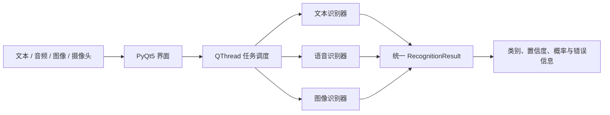

# 基于文本、语音与面部图像的本地多模态情绪识别系统实验报告

## 摘要

情绪识别系统常面临输入形式不统一、模型输出难以比较以及离线部署困难等问题。本项目设计并实现了一套面向 Windows 桌面的本地多模态情绪识别系统，在统一的七类情绪标签空间内分别处理中文/英文文本、语音和面部图像，并通过一致的结果协议输出预测类别、置信度与类别概率。文本模块比较了 mBERT 与 XLM-R 两种跨语言 Transformer；语音模块比较了手工声学特征与 RBF-SVM、SIMSAN 以及 WavLM 表征方案；图像模块采用 YuNet 完成人脸检测与对齐，并在 RAF-DB Basic 上从随机初始化训练 SE-ResNet18 表情分类器。实验表明，XLM-R 在 8,537 条文本测试样本上取得 67.08% 准确率和 60.65% Macro-F1，整体优于 mBERT；SE-ResNet18 在 RAF-DB 官方测试集上取得 77.71% 准确率和 69.22% Macro-F1，水平翻转测试时增强将准确率进一步提高到 78.16%；SIMSAN 双检查点集成在一次性锁定的跨说话人测试集上取得 54.98% 准确率和 54.57% Macro-F1。WavLM 方案在同一固定测试集上的复评结果达到 66.58% 准确率和 66.81% Macro-F1，但由于测试集此前已被打开，该结果不视为严格盲测。软件层面的 17 项自动化测试全部通过。结果说明，该系统已经形成可运行、可复现且能诚实暴露失效边界的三模态实验原型；但三种模态目前独立推理，尚未实现跨模态特征或决策融合，真实开放环境中的泛化能力仍需进一步验证。

**关键词：** 情绪识别；多模态情感计算；跨语言文本分类；语音情感识别；面部表情识别；本地部署

## 1. 实验目的

本实验旨在构建一套可在 Windows 本地运行的情绪识别原型，并回答以下问题：

1. 能否用统一的七类情绪标签和结果结构接入文本、语音与图像三类输入；
2. 在固定数据划分下，不同文本基础模型的中英文情绪分类能力有何差异；
3. 语音模型在同域条件与跨说话人条件下的性能差距有多大；
4. 从随机初始化训练的轻量级面部表情模型能否在 RAF-DB 官方测试集上获得稳定表现；
5. 训练、推理、异常处理和桌面交互流程能否通过自动化测试与本地打包验证。

本项目所称“多模态”是指一个应用支持多种输入模态，并将结果映射至统一标签空间；当前版本不进行文本、语音和图像之间的联合建模或跨模态融合。

## 2. 系统总体设计

系统采用界面层、任务调度层、模态识别层和统一领域层四级结构。PyQt5 界面接收文本、Excel、音频、图片与摄像头帧；耗时推理由 `QThread` 执行，以避免阻塞主线程；三个识别器分别完成模态内预测；最终由 `RecognitionResult` 统一封装七类概率、最高置信度、预测标签、模型名称与错误信息。系统默认在本地完成推理，不主动上传用户输入。

统一标签集合为愤怒（anger）、厌恶（disgust）、恐惧（fear）、喜悦（joy）、悲伤（sadness）、惊讶（surprise）和中性（neutral）。界面中的概率用于同一模型内部的相对置信度展示，不能直接解释为经过校准的现实概率。

## 3. 数据集与实验设置

### 3.1 文本数据

文本数据由 GoEmotions 的 Ekman 映射版本与 OCEMOTION 中文语料构成。处理后的 `dataset_v1` 共包含 85,153 条单标签样本，其中英文 49,469 条、中文 35,684 条。训练集、验证集和测试集分别包含 68,102、8,514 和 8,537 条样本，随机种子固定为 42；三个数据文件均记录了 SHA-256 校验值。对于映射后仍含多个 Ekman 标签的 GoEmotions 样本，数据准备脚本选择排除而非强制压缩成单标签，以减少标签语义污染。

文本类别分布明显不均衡：喜悦样本为 32,079 条，恐惧仅为 1,287 条。因此，实验同时报告 Accuracy 与 Macro-F1，并以验证集 Macro-F1 选择最佳检查点。mBERT 与 XLM-R 均训练 4 个 epoch，最大序列长度为 128，学习率为 2×10⁻⁵，有效批量大小为 16。

### 3.2 语音数据

语音实验使用 TESS、CREMA-D 与 EmoDB。所有音频统一解码为 16 kHz 单声道。传统基线提取 MFCC、Delta-MFCC、能量、过零率、频谱质心、频谱滚降及持续时间等固定长度统计特征，并输入带 `StandardScaler` 的 RBF-SVM。

为降低模型记忆说话人和录音环境的风险，后续实验使用按说话人划分的锁定协议。SIMSAN 的最终测试集在开发阶段保持封存，仅在配置冻结后评估一次，共 1,224 条样本、16 位未见说话人，覆盖愤怒、厌恶、恐惧、喜悦、悲伤和中性六类。由于现有数据中没有可作为未见说话人的惊讶样本，该类未进入最终盲测，但保留在验证阶段。

### 3.3 图像数据

图像分类使用 RAF-DB Basic v1.1。训练、验证和官方测试集分别包含 11,043、1,228 和 3,068 张对齐人脸图像。输入图像调整为 100×100 RGB，并按 `x/127.5-1` 归一化。SE-ResNet18 从随机权重开始训练 60 个 epoch，批量大小为 256，初始学习率为 0.003；以验证准确率选择最佳检查点。部署流程先用 YuNet 检测人脸和五点关键点，再完成人脸对齐与分类，并对原图和水平翻转图的 logits 取均值实施测试时增强（TTA）。

### 3.4 评价指标与软件验证

主要指标为 Accuracy 与 Macro-F1。Accuracy 反映整体正确率，Macro-F1 对各类别等权平均，更适合评价类别不均衡条件下的性能。除离线模型评价外，实验还运行了领域对象、数据准备、识别器、图像异常处理与界面行为等自动化测试。测试命令采用无界面 Qt 后端，并将临时目录置于项目工作区。

## 4. 实验结果

### 4.1 文本情绪识别

| 模型 | 验证集最佳 Macro-F1 | 测试 Accuracy | 测试 Macro-F1 | 英文 Macro-F1 | 中文 Macro-F1 |
| --- | ---: | ---: | ---: | ---: | ---: |
| mBERT | 60.24% | 66.79% | 59.60% | 63.84% | 49.07% |
| XLM-R | **61.35%** | **67.08%** | **60.65%** | 63.16% | **51.73%** |

XLM-R 的总体测试 Accuracy 和 Macro-F1 分别比 mBERT 高 0.29 和 1.05 个百分点，并在中文子集上提高 2.66 个百分点；mBERT 的英文 Macro-F1 则高 0.68 个百分点。两种模型的中文表现均明显低于英文表现，说明统一标签并未消除语料来源、语言表达习惯和类别分布差异。由于中文数据规模较小且恐惧类样本稀缺，后续工作应优先检查分语言、分类别混淆矩阵，而不是仅追求整体准确率。

### 4.2 图像表情识别

| 模型与设置 | 官方测试 Accuracy | Macro-F1 | 说明 |
| --- | ---: | ---: | --- |
| SE-ResNet18 | 77.71% | 69.22% | 随机初始化训练 |
| SE-ResNet18 + Flip TTA | **78.16%** | — | 平均原图与翻转图 logits |
| RafEmotionNet | 77.64% | 68.92% | 同数据与官方测试协议 |

SE-ResNet18 在第 44 个 epoch 达到最佳验证准确率 77.85%，官方测试准确率为 77.71%。水平翻转 TTA 将测试准确率提高 0.46 个百分点，增益有限但稳定。分类别结果显示，喜悦的 F1 最高（89.41%），恐惧和厌恶的 F1 分别为 52.29% 和 44.62%。这一差异与类别支持度和表情视觉相似性一致：喜悦类测试样本有 1,185 张，而恐惧类仅 74 张。结果表明总体准确率会被高频且易识别的喜悦类显著影响，因此 Macro-F1 与分类别召回率更能揭示模型边界。

### 4.3 语音情绪识别

| 模型与协议 | 测试样本数 | Accuracy | Macro-F1 | 证据等级 |
| --- | ---: | ---: | ---: | --- |
| 手工特征 + RBF-SVM，跨说话人测试 | 2,584 | 50.81% | 44.88% | 独立跨说话人测试 |
| SIMSAN 双检查点集成，锁定最终测试 | 1,224 | 54.98% | 54.57% | 一次性盲测，主要结论 |
| WavLM + SIMSAN，固定测试集复评 | 1,224 | **66.58%** | **66.81%** | 测试集已被先前模型打开，非严格盲测 |

在锁定的说话人独立测试中，SIMSAN 集成取得 54.98% Accuracy 和 54.57% Macro-F1。分类别 F1 中，愤怒最高（63.00%），喜悦最低（45.05%）；中性召回率达到 84.44%，但精确率仅为 41.64%，说明模型容易把其他情绪误判为中性。

WavLM 表征方案在同一固定测试集上达到 66.58% Accuracy 和 66.81% Macro-F1，相比 SIMSAN 数值分别提高 11.60 和 12.24 个百分点。然而，该测试集已被早期模型评估过，因此这一差异只能作为后续模型改进的复评证据，不能替代新建说话人盲测。传统 RBF-SVM 的测试样本数和具体划分与 SIMSAN 不完全相同，表中结果用于呈现工程演进，不作严格配对统计比较。

### 4.4 模型规模与部署

项目中的 YuNet 人脸检测器约含 5.31 万参数，序列化大小约 0.22 MiB；现有轻量图像分类器约含 119.39 万参数，大小约 4.57 MiB；RBF-SVM 使用 177 维特征和 1,109 个支持向量，大小约 1.61 MiB。这些模块适合嵌入本地桌面应用。Transformer 文本模型体积显著更大，当前打包配置未将约 4.4 GB 的文本运行时完整嵌入 EXE，因此完整离线分发仍需模型下载、外置资源或量化方案。

### 4.5 软件测试结果

在 `QT_QPA_PLATFORM=offscreen` 条件下运行测试套件，17 项测试全部通过。覆盖内容包括：七类标签归一化、结果概率约束、多标签文本样本排除、数据清单校验、缺失模型与空文本错误、无脸图像错误、已训练语音识别器的七类概率输出，以及基本界面交互。初次执行时，pytest 默认临时目录因系统权限不可访问而产生 7 个 setup error；将 `--basetemp` 与缓存目录显式指向工作区后全部通过。该问题属于测试运行环境权限配置，不是业务逻辑失败。

## 5. 讨论

本项目的主要贡献不是提出单一模态上的全新网络结构，而是把三个具有不同数据、预处理和部署依赖的识别流程组织为可复现的本地系统，并使用统一标签与错误协议约束输出。文本与图像实验采用固定测试集，语音实验进一步引入说话人独立划分和封存测试策略，使“模型在训练分布内表现好”与“模型对新说话人有效”得到明确区分。

实验也揭示了三类重要边界。第一，语音模型对说话人和数据域高度敏感；受控语料上的高分不能外推到开放录音环境。第二，七类离散标签压缩了连续、混合且依赖语境的真实情绪，面部表情也不等同于个体的内在心理状态。第三，当前三种模态独立预测，不能利用文本语义、声学韵律与面部动作之间的互补信息；因此报告不声称系统已经实现多模态融合。

文本结果中的中英文差距提示，跨语言模型仍受语料来源和标注规范影响。图像结果中的长尾类别退化则说明，仅以总体准确率选择模型可能低估恐惧和厌恶等少数类别的失败风险。WavLM 复评结果显示预训练语音表征具有潜力，但由于测试集已被打开，下一轮研究应重新划分从未参与模型选择的说话人集合，或引入外部语音库进行真正独立验证。

在应用层面，系统适合作为情感计算教学、算法比较和本地交互原型，不应直接用于医疗诊断、招聘筛选、教育惩戒或执法判断。涉及人脸、语音和文本数据时，还需遵守数据集许可、知情同意、隐私保护和用途限制。

## 6. 结论

本实验完成了一套支持中英文文本、语音、图像和摄像头输入的本地情绪识别系统，并通过统一七类标签、固定数据版本、独立测试协议、自动化测试和真实错误返回增强了结果的可复现性。现有证据中，XLM-R 的文本测试 Macro-F1 为 60.65%，SE-ResNet18 的 RAF-DB 官方测试准确率为 77.71%，SIMSAN 在一次性锁定的跨说话人测试中的 Macro-F1 为 54.57%；WavLM 复评达到 66.81% Macro-F1，但不属于严格盲测。上述结果支持“系统已形成可运行的三模态研究原型”这一结论，却不足以证明其在任意语言、说话人、场景或人群中均能稳定工作。后续工作的优先级应依次为：建立新的跨说话人外部测试、补充文本长尾类别分析、开展图像跨数据集验证，并在获得成对多模态样本后研究可信的决策级或特征级融合。

## 7. 可复现性说明

- 文本数据版本：`dataset_v1`，随机种子 42，数据文件具有 SHA-256 校验值；
- 文本模型：mBERT 与 XLM-R 均训练 4 个 epoch、学习率 2×10⁻⁵、最大长度 128、有效批量大小 16；
- 图像模型：RAF-DB Basic v1.1，SE-ResNet18 随机初始化，60 个 epoch，批量大小 256；
- 语音协议：SIMSAN 使用锁定的说话人独立划分，最终测试仅在配置冻结后执行一次；
- 软件测试：17 项测试通过，需将 pytest 临时目录设置为工作区内可写路径；
- 概率边界：输出分数用于模型内部相对比较，未声称经过概率校准；
- 数据边界：原始语音、人脸数据及部分模型权重受许可或体积限制，不随源码统一分发。

## 8. 主要术语表

| 规范术语 | 首次定义 | 本报告中的使用约定 |
| --- | --- | --- |
| 多模态情绪识别系统 | 支持文本、语音和图像输入的统一应用 | 不等同于跨模态融合 |
| Macro-F1 | 各类别 F1 的等权平均 | 作为类别不均衡下的主要指标 |
| mBERT | multilingual BERT | 文本基线模型 |
| XLM-R | XLM-RoBERTa | 跨语言文本模型 |
| SIMSAN | 项目中的说话人独立语音模型 | 以锁定测试结果作为主要语音结论 |
| WavLM | 预训练语音表征模型 | 固定测试集复评，不称为严格盲测 |
| SE-ResNet18 | 引入通道注意力的 ResNet18 | RAF-DB 七类图像分类器 |
| TTA | test-time augmentation，测试时增强 | 指水平翻转后平均 logits |

## 9. 参考文献

1. Demszky, D. *et al.* GoEmotions: A Dataset of Fine-Grained Emotions. *Proceedings of ACL* (2020).
2. Li, M., Long, Y., Lu, Q. & Li, W. Emotion Corpus Construction Based on Selection from Hashtags. *Proceedings of LREC* (2016).
3. Dupuis, K. & Pichora-Fuller, M. K. Toronto Emotional Speech Set (TESS). Scholars Portal Dataverse, doi:10.5683/SP2/E8H2MF.
4. Cao, H. *et al.* CREMA-D: Crowd-sourced Emotional Multimodal Actors Dataset. *IEEE Transactions on Affective Computing* **5**, 377–390 (2014).
5. Burkhardt, F. *et al.* A Database of German Emotional Speech. *Proceedings of Interspeech* (2005).
6. Li, S., Deng, W. & Du, J. Reliable Crowdsourcing and Deep Locality-Preserving Learning for Expression Recognition in the Wild. *Proceedings of CVPR* (2017).
7. OpenCV. OpenCV Zoo: YuNet Face Detection.

## 10. 证据来源与待补材料

本报告中的数值来自项目内的数据清单、模型 `metrics.json`、训练记录、图表源数据与本次测试运行。正式提交前建议补充实验设备表（CPU、GPU、内存、操作系统与主要依赖版本）、各模型训练时长、随机种子重复实验的均值与标准差，以及文本和图像的完整混淆矩阵。除 mBERT 训练记录明确记载 RTX 4060 Laptop 8 GB 外，本报告未推断其他训练任务的硬件配置。
